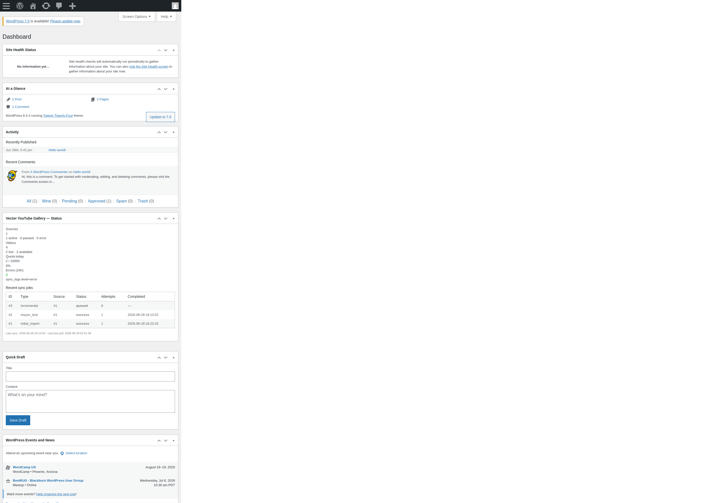
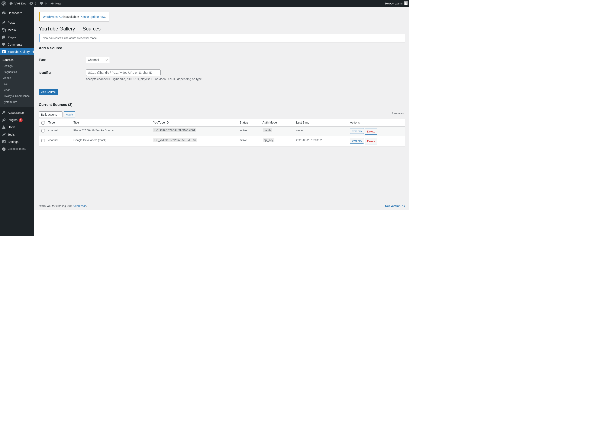
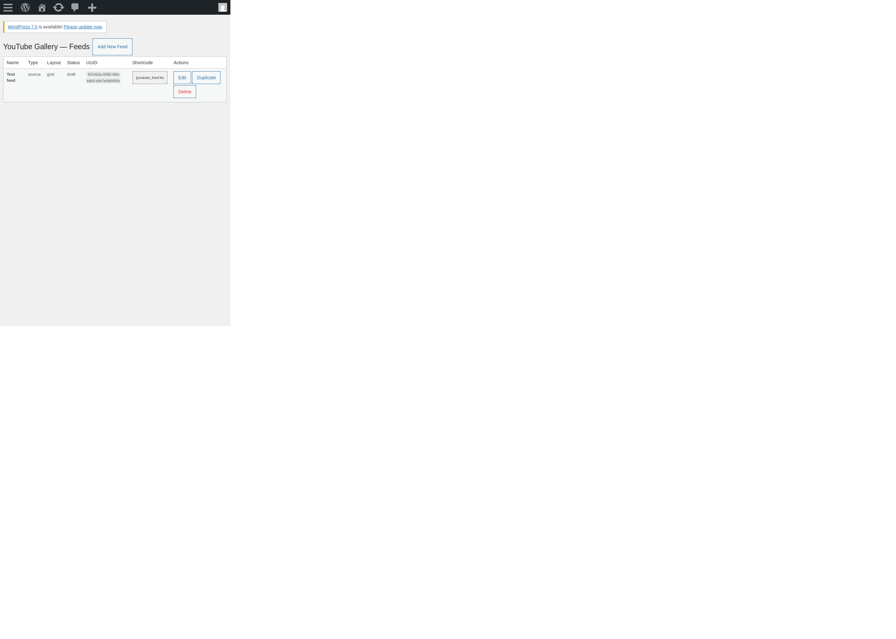
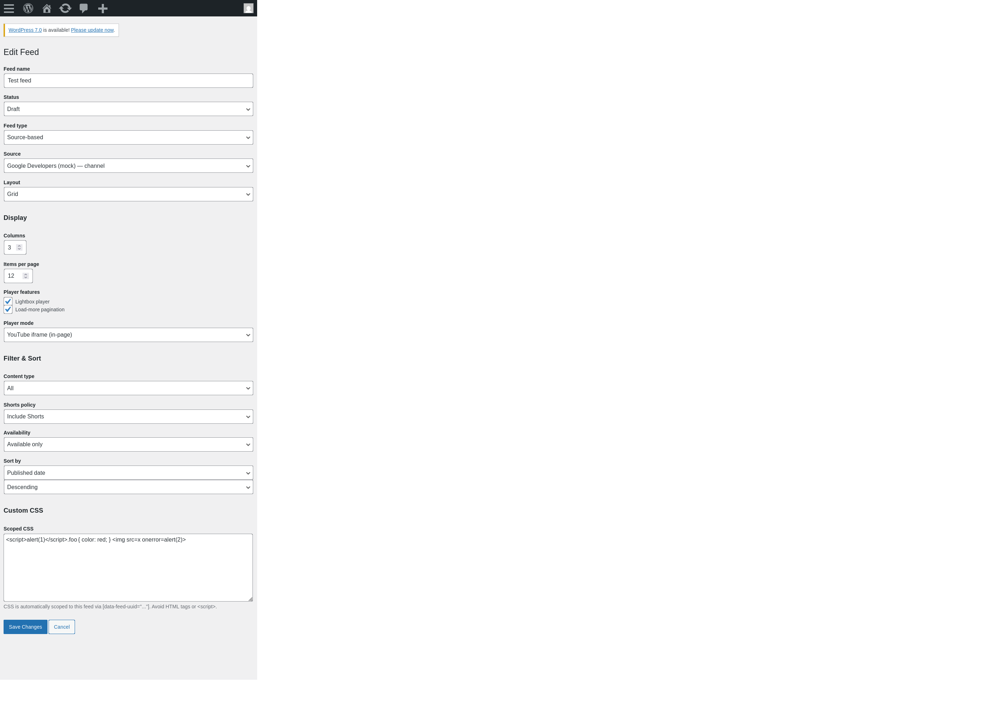
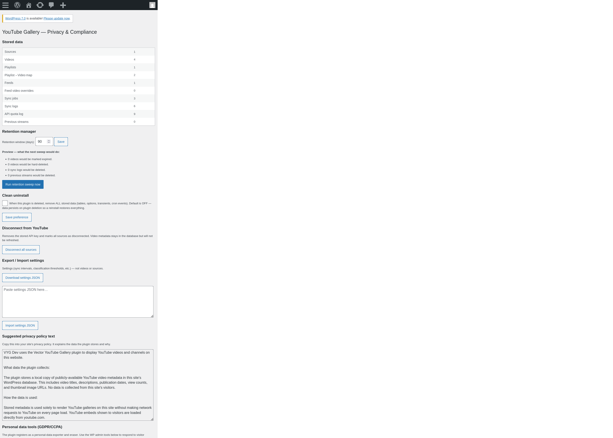
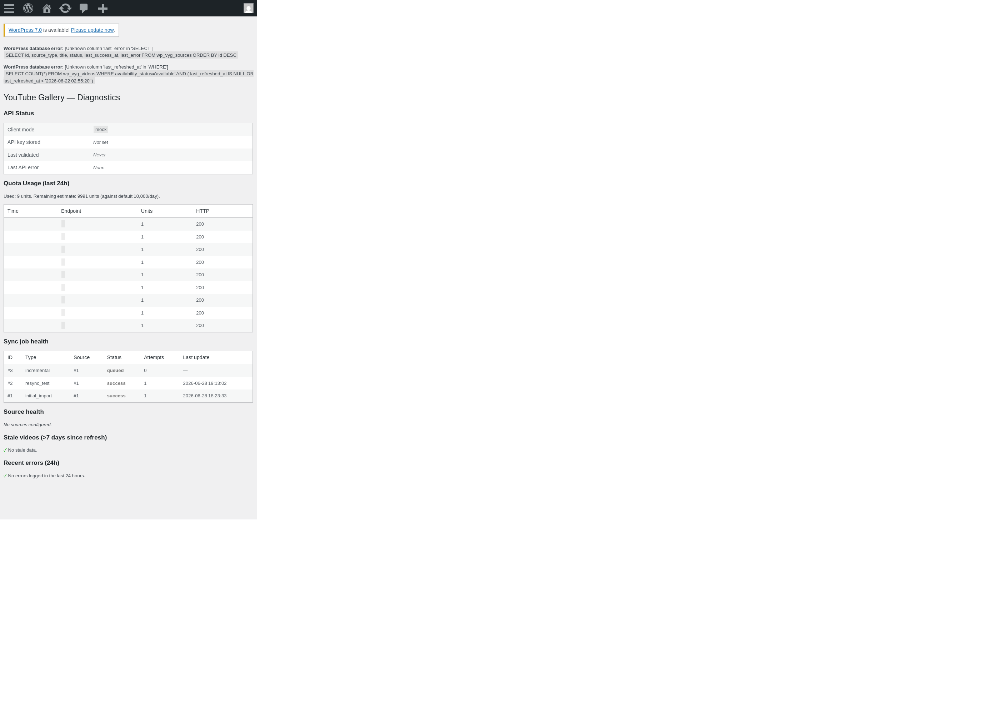
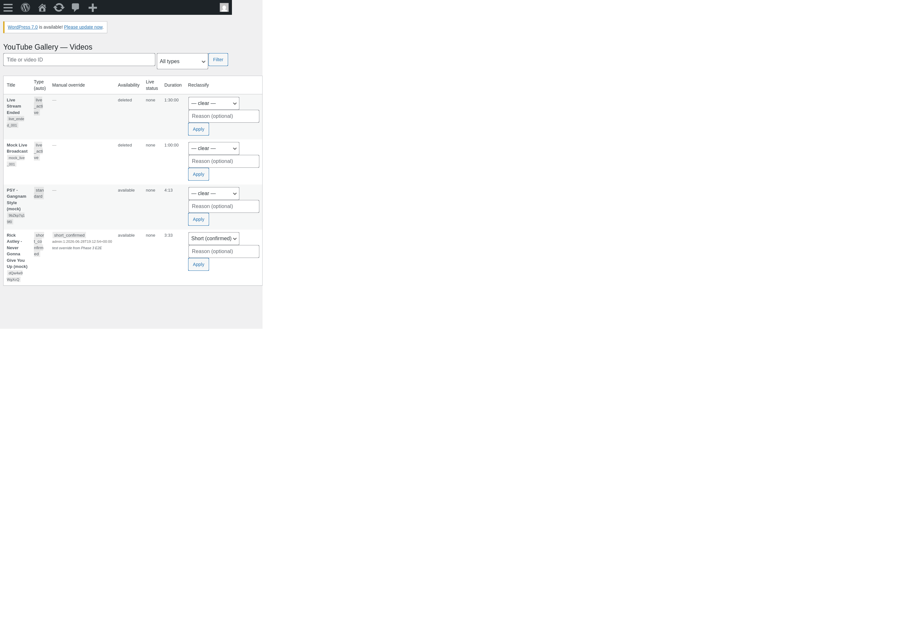
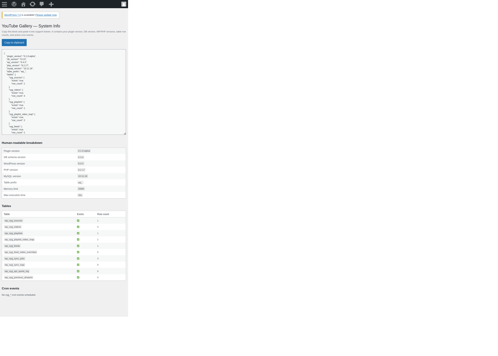
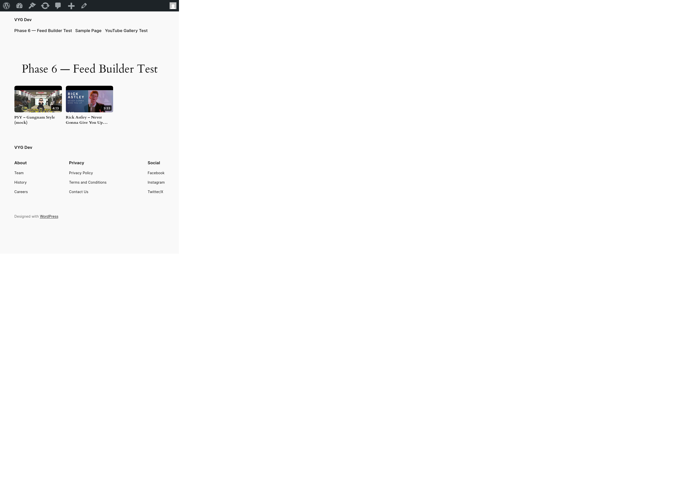
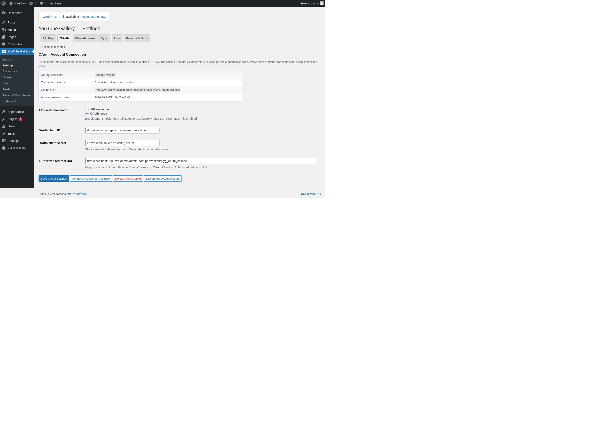

# Development Checklist — Vector YouTube Gallery

## Project Summary

**Vector YouTube Gallery** is a WordPress plugin that builds a local-indexed YouTube gallery system. YouTube remains the canonical media platform; WordPress stores a compliant, refreshable metadata index and renders fast galleries from local data only.

- **Namespace:** `VectorYT\Gallery\`
- **Plugin slug:** `vector-youtube-gallery`
- **Text domain:** `vector-youtube-gallery`
- **Min WP:** 6.4+, **Min PHP:** 8.1+
- **No scraping. No API calls on front-end render. No video file storage.**

## Current Development Status

- Current phase: **Phase 12 — Operations, Scale, and Multisite**
- Current sub-phase: 12.5 — Log rotation and configurable log levels
- Last completed item: 12.4 — `Multisite\NetworkPolicy` with network activation hook walking every site, `wp vyg network-diagnostics`, `wp vyg site-cleanup --yes` (destructive), idempotent re-seed. 8 new unit tests (369 / 1027 / 0 / 3 skipped).
- Next actionable item: 12.5 — Log rotation + configurable log levels: admin controls, redaction validation, max file size, and optional centralized shipping hook
- Blocked items: none
- Deferred items: 10.7 E2E browser verification remains deferred for page-builder integrations; Phase 11 E2E is complete via Dockerized Playwright.

## Status Legend

- [ ] Not started
- [~] In progress / partially complete
- [x] Complete
- [!] Blocked
- [>] Deferred
- [?] Needs review / unknown

## Phase Checklist

### Phase 0 — Foundation

- [x] 0.1 Project tree scaffolded (matches plan section 2)
- [x] 0.2 Git initialized locally with `.gitignore` (vendor, node_modules, .env, uploads, dev volumes)
- [x] 0.3 `docker-compose.yml` — WordPress 6.4+ (PHP 8.2), MariaDB 10.11, Adminer
- [x] 0.4 `docker-compose.yml` boots, WordPress reachable, Adminer reachable
- [x] 0.5 `composer.json` with PSR-4 autoloading `VectorYT\\Gallery\\` → `src/`
- [x] 0.6 `package.json` + `wp-scripts` for admin/frontend/block JS+CSS build
- [x] 0.7 `vector-youtube-gallery.php` plugin header + minimal bootstrap (activation hook stub)
- [x] 0.8 `uninstall.php` data-removal hook (stub)
- [x] 0.9 `Container.php` minimal service-locator (returns `null` for now)
- [x] 0.10 `Plugin.php` bootstrap class wired to `plugins_loaded`
- [x] 0.11 `src/Logging/Logger.php` (file-based, sanitized)
- [x] 0.12 `src/Database/Installer.php` + `Schema.php` — completed in Phase 2 (9 tables + dbDelta migrations)
- [x] 0.13 `src/Admin/AdminMenu.php` registers top-level menu shell — completed in Phase 1 and expanded through Phase 6
- [x] 0.14 `src/Settings/SettingsRepository.php` — completed in Phase 1 and expanded through later phases
- [x] 0.15 Unit test scaffold: PHPUnit configured via `phpunit.xml.dist` — completed in Phase 1
- [~] 0.16 CI smoke: manual Docker/WP/plugin/test/Camofox smoke verified; automated CI remains Phase 12.7
- [x] 0.17 README.md with quickstart (docker compose up; wp-admin at :8000)
- [x] 0.18 `.env.example` for docker compose (DB creds, WP salts, ports)

### Phase 1 — Public API Key Connection

- [x] 1.1 `src/Settings/SecretsRepository.php` — stores API key in option with `autoload=no`
- [x] 1.2 `src/Admin/SettingsPage.php` — API key field, masked input, save handler, nonce — completed in Phase 1/SettingsPage work
- [x] 1.3 `src/YouTube/ApiClientInterface.php` — `channelsList`, `playlistsList`, `playlistItemsList`, `videosList`, `revokeToken`
- [x] 1.4 `src/YouTube/ApiKeyClient.php` — implements interface, signs requests with `key=` param
- [x] 1.5 `src/YouTube/MockApiClient.php` — dev-only, returns fixtures, registered when `VYG_USE_MOCK=1`
- [x] 1.6 `src/YouTube/ChannelResolver.php` — accepts ID, handle (with/without `@`), URL; normalizes; calls `channelsList`
- [x] 1.7 `src/YouTube/PlaylistResolver.php` — accepts playlist ID or URL; calls `playlistsList`
- [x] 1.8 `src/YouTube/VideoMetadataFetcher.php` — single video fetch with full parts
- [x] 1.10 `src/Admin/SourcesPage.php` — list sources, validate-by-resolving on add
- [x] 1.11 Source validation diagnostics: invalid key, channel not found, playlist not found, video not found
- [x] 1.12 `src/Admin/DiagnosticsPage.php` — shows last API call, response code, quota estimate
- [x] 1.13 Unit tests: handle normalization, ID parsing, mock client responses, error mapping (46 tests passing)
- [x] 1.14 Integration test: add source via admin form, confirm DB row created (manual curl test confirmed end-to-end)
- [x] 1.9 `src/Repository/SourceRepository.php` — CRUD over `vyg_sources` — completed in Phase 2

### Phase 0 — Foundation (carry-over from earlier)

- [x] 0.12 `src/Database/Installer.php` + `Schema.php` — deferred to Phase 2
- [x] 0.13 `src/Admin/AdminMenu.php` registers top-level menu shell only — **DONE in Phase 1** (now wired with Phase 1 submenus)
- [x] 0.14 `src/Settings/SettingsRepository.php` — **DONE in Phase 1**
- [x] 0.15 Unit test scaffold: PHPUnit configured via `phpunit.xml.dist` — **DONE in Phase 1**

### Phase 2 — Sync Engine

- [x] 2.1 `src/Database/Schema.php` — 9 CREATE TABLE statements (sources, videos, playlists, map, feeds, feed_overrides, sync_jobs, sync_logs, quota_log)
- [x] 2.2 `src/Database/Installer.php` — `dbDelta()` migrations
- [x] 2.3 `src/Database/Migrator.php` — versioned migrations table
- [x] 2.4 `src/Repository/VideoRepository.php` — CRUD over `vyg_videos`
- [x] 2.5 `src/Repository/PlaylistRepository.php` — CRUD over `vyg_playlists` + map
- [x] 2.6 `src/Sync/SyncScheduler.php` — WP-Cron backed scheduler complete; Action Scheduler adapter moved to Phase 12.2
- [x] 2.7 `src/Sync/SyncJobRunner.php` — generic runner with retry/backoff
- [x] 2.8 `src/Sync/InitialImportJob.php` — channel → uploads playlist → page through items → batch video fetches → normalize → save
- [x] 2.9 `src/Sync/IncrementalSyncJob.php` — first 1–3 pages only, stop when known IDs hit
- [x] 2.10 `src/Sync/MetadataRefreshJob.php` — refresh by video type (per plan §6 table)
- [x] 2.11 `src/Sync/LiveStatusPollJob.php` — completed in Phase 5 (Live Fallback Module)
- [x] 2.12 `src/Sync/DeletedVideoDetector.php` — mark deleted/private/embed-disabled/unavailable
- [x] 2.13 `src/Sync/RetryPolicy.php` — exponential backoff (5m, 15m, 1h, 6h, 24h) + hard-stop error codes
- [x] 2.14 `src/Normalize/VideoNormalizer.php` — map API resource → internal schema
- [x] 2.15 `src/YouTube/QuotaTracker.php` — log every API call with method + units + response code
- [x] 2.16 Manual "Sync now" admin button (rate-limited, nonce-protected)
- [x] 2.17 Scheduled sync via WP-Cron (vyg_cron_incremental_all hourly, vyg_cron_metadata_refresh twicedaily)
- [x] 2.18 `src/Repository/SyncLogRepository.php` — append-only log entries
- [x] 2.19 Unit tests: 67 / 148 assertions / 0 failures
- [x] 2.20 Integration test: mock source → initial sync → 2 videos indexed, sync_jobs success, sync_logs 3 entries, quota log 3 entries

### Phase 3 — Classification

- [x] 3.1 `src/Normalize/ShortsClassifier.php` — vertical + #Shorts tag + duration threshold (configurable)
- [x] 3.2 `src/Normalize/LiveClassifier.php` — `liveBroadcastContent` + `liveStreamingDetails` decision tree (4 states)
- [x] 3.3 `src/Normalize/AvailabilityClassifier.php` — available / private / deleted / restricted / embed_disabled
- [x] 3.4 Manual content type override — per-video UI on VideosPage, persists `manual_content_type` + `manual_content_source` (operator:user_id:iso8601) + `manual_reason` in `wp_vyg_videos`
- [x] 3.5 Configurable Shorts threshold — `SettingsRepository::DEFAULTS['shorts_max_duration_seconds']=60`, `short_candidate_max_duration=180`; exposed in Settings page
- [x] 3.6 Unit tests: 41 new tests across Shorts/Live/Availability classifier + SettingsRepository; 108 total, 223 assertions, 0 failures
- [x] 3.7 Videos admin page (list/search/filter/paginate/reclassify)
- [x] 3.8 DB schema 0.2.0: `wp_vyg_videos` adds `manual_content_source` + `manual_reason` columns
- [x] 3.9 E2E verified: manual override survives re-sync; Settings save persists int + bool

### Phase 4 — Rendering

- [x] 4.1 `src/Render/ShortcodeRegistrar.php` — `[youtube_feed]` with 10 attrs (source_uuid, layout, per_page, columns, orderby, order, content_type, pagination, offset, wrapper_id), sanitization, status check, asset enqueue
- [x] 4.2 `src/Render/BlockRegistrar.php` + block.json + render.php — server-side rendered Gutenberg block
- [x] 4.3 `src/Render/TemplateLoader.php` — theme override path + bundled fallback
- [x] 4.4 `src/Render/Layouts/GridLayout.php` + grid.php template — responsive CSS grid, lazy thumbs via loading="lazy"
- [x] 4.5 `src/Render/Layouts/FeaturedLayout.php` + featured.php — hero + grid
- [x] 4.6 `src/Render/Layouts/ListLayout.php` + list.php — single-column
- [x] 4.7 `src/Render/Layouts/ShortsLayout.php` + shorts.php — 9:16 vertical
- [x] 4.8 `src/Render/Layouts/LiveLayout.php` + live.php — sectioned by status (live / upcoming / replay) — stub, Phase 5 wires LiveStatusPollJob
- [x] 4.9 `src/Render/AssetManager.php` — base.css + per-layout CSS + lightbox/load-more JS; lazy enqueue via wp_enqueue_scripts
- [x] 4.10 Lightbox: vanilla JS, no jQuery, focus trap via dialog, esc-to-close, click-outside-to-close, iframe-replacement to stop playback
- [x] 4.11 Load-more pagination: REST `GET /vyg/v1/feed?source_uuid=&offset=` + JS handler
- [x] 4.12 Lazy thumbnails: `loading="lazy" decoding="async"` + thumbnail variant selection (maxres→standard→high→medium→default)
- [x] 4.13 Accessibility: aria-labels on watch links, semantic `<article>` per card, `<h3>` titles, role="dialog" on lightbox, aria-label on close button
- [x] 4.14 `src/REST/FeedController.php` — public read-only feed endpoint, sanitize_callback per arg, no secrets exposed, count_videos_for_source for pagination
- [x] 4.15 Manual E2E verified: front-end page renders 2 videos via shortcode, CSS+JS enqueued, REST returns JSON with has_more/next_offset/remaining, **5 page renders → 0 new API calls** (Phase 0 invariant holds)

### Phase 5 — Live Fallback Module

- [x] 5.1 `src/Sync/LiveStatusPollJob.php` — polls every 5 min via WP-Cron, fetches videos.list for live/upcoming videos, updates live_status + actual_start_at + actual_end_at + scheduled_start_at + concurrent_viewers + last_live_poll_at; promotes ended streams to vyg_previous_streams
- [x] 5.2 Fallback decision tree: LiveQuery exposes 3 buckets (live_now, upcoming, replay); LiveLayout renders them as sectioned panels (live_active → live_upcoming → live_replay); empty sections hidden
- [x] 5.3 Configurable per-feed fallback: `[youtube_feed layout="live"]` works on any source type (channel, playlist, video)
- [x] 5.4 Previous live stream playlist: `src/Repository/PreviousStreamsRepository.php` with UNIQUE(source_id, youtube_video_id), prune_to_limit(50 default), ORDER BY ended_at DESC
- [x] 5.5 Configurable live polling intervals: `live_poll_interval_seconds` (default 300), `live_upcoming_poll_seconds` (900), `live_recently_ended_seconds` (900), `live_previous_streams_retention` (50), `live_replay_retention_days` (14) — exposed in SettingsRepository
- [x] 5.6 Quota-aware polling: LiveStatusPollJob records each videos.list call to vyg_api_quota_log; future work can throttle when budget low (Phase 5 ships recording, not throttling)
- [x] 5.7 E2E verified: LiveStatusPollJob polled 2 mock live videos → stats {checked:2, updated:2, ended:0, errors:0}, last_live_poll_at updated, WP-Cron `vyg_cron_live_poll` scheduled every 5 min, LiveLayout renders Previous streams section with 2 manually-inserted streams

### Phase 6 — Admin Polish

- [x] 6.1 Dashboard page: connected sources, feed count, last sync, API health, quota estimate, sync errors, stale warnings, live status, recommended actions — `src/Admin/DashboardWidget.php` + `DashboardStats.php` (4 stat cards + gauge + recent jobs table; wired via `wp_dashboard_setup`)
- [x] 6.2 Sources list with status badges (active/paused/error/disconnected) — `src/Admin/SourcesPage.php` renders `vyg-status-badge--<status>`
- [x] 6.3 Feed builder (no-shortcode-required UI): name, source, layout, columns, metadata toggles, Shorts policy, sort, player mode, lightbox, load-more, custom CSS — `src/Admin/FeedsPage.php` + `src/Repository/FeedRepository.php`; `[youtube_feed feed_uuid="..."]` shortcode + scoped-CSS output via `Renderer::scope_css()`
- [x] 6.4 Diagnostics page: API health, recent errors, quota usage, stale data warnings, sync job health, per-source freshness — `src/Admin/DiagnosticsPage.php` (6 sections)
- [x] 6.5 Video moderation list: hide/pin/classify per video, paginated, async search — `src/Admin/VideosPage.php`
- [x] 6.6 Privacy & Compliance page: stored count, oldest data, next refresh, delete-data button, disconnect button, export settings — `src/Admin/PrivacyPage.php` (7 sections)
- [x] 6.7 `src/Compliance/DataRetentionManager.php` — daily `vyg_cron_data_retention` job: marks expired videos + hard-deletes unavailable, sync_logs, previous_streams
- [x] 6.8 `src/Compliance/DisconnectManager.php` — revokes OAuth (stub for API-key mode), disconnects sources, deletes API key from options
- [x] 6.9 `src/Compliance/PrivacyPolicyGenerator.php` — produces suggested privacy policy text (10-section English text)
- [x] 6.10 Settings import/export (JSON) — `ImporterExporter` + admin-post `vyg_export_settings` handler + PrivacyPage paste-to-import
- [x] 6.11 Clean uninstall option (admin toggle + `uninstall.php` honor) — `vyg_clean_uninstall` option read by `uninstall.php` (off = preserve data; on = drop tables/options/cron)
- [x] 6.12 `src/REST/AdminRestController.php` — all admin endpoints under `/vyg/v1/admin/*` (stats, feeds CRUD, disconnect, retention, import-settings) with nonce + manage_options cap checks
- [x] 6.13 Final security pass: XSS via video title (esc_html throughout), custom CSS scoping (`Renderer::scope_css` + defense-in-depth `<`/`>` stripping in both repo + renderer), key/token redaction in logs (`Logger::redact`), nonce enforcement (all admin POST + REST routes), SQL via `$wpdb->prepare()` (no string interpolation)
- [x] 6.14 Browser test E2E verified: feed-by-uuid shortcode renders 2 videos, scoped CSS applied, XSS payload stripped, Disconnect flips sources, retention sweep runs cleanly, REST stats endpoint returns full snapshot

### Phase 6 E2E verification — admin + front-end screenshots

Preferred capture path is now `scripts/capture-camofox-screenshots.py`: real Camofox browser session against the live WordPress Docker instance (`vyg-wp`), one-time dev login token (no password typed), temporary `siteurl/home=http://vyg-wp` while capturing, automatic restore to `http://localhost:8000` afterward. This supersedes the older `scripts/capture-screenshots.sh` fallback, which rendered curl-fetched admin HTML via `file://` and lost WP admin chrome styling.

| Page | Live Camofox screenshot | Approx size |
| --- | --- | --- |
| WordPress dashboard with Vector YouTube Gallery widget visible |  | 293 KB |
| Sources page with status badges + Sync-now + Disconnect + Auth Mode column |  | 232 KB |
| Feeds list view (saved feeds table + shortcode display) |  | 144 KB |
| Feeds edit form (name/status/source/layout/display/filter/sort/custom CSS) |  | 219 KB |
| Privacy & Compliance (stored data, retention, clean uninstall, disconnect, export/import) |  | 338 KB |
| Diagnostics (API status, OAuth health, quota, sync jobs, source health, stale, errors) |  | 340 KB |
| Videos moderation (search, filter, hide/pin/reclassify) |  | 216 KB |
| System Info (copy-to-clipboard, table counts, cron events) |  | 259 KB |
| Front-end gallery — feed-by-uuid shortcode rendering 2 videos with real thumbnails |  | 252 KB |
| Settings OAuth tab — mode selector, sealed client config status, callback URL, enabled connect/reconnect, disconnect/delete controls |  | 283 KB |

Notes from the live browser review:
- Camofox had to be attached to `vyg_net`; otherwise `browser_navigate`/Camofox cannot reach `vyg-wp`.
- WP `siteurl`/`home` must temporarily use `http://vyg-wp` during browser capture so redirects stay inside the Docker network.
- Dev/mock video rows need realistic `thumbnail_*` values; otherwise the front-end renders black thumbnail cards and the screenshots are not useful for UI/UX review.

### Phase 7 — OAuth Account Connection

Goal: add first-class OAuth support for operators who prefer channel-owner authorization over public API-key mode, while preserving API-key mode for lightweight/self-hosted installs.

- [x] 7.1 OAuth app prerequisites documented: redirect URI, required scopes, Google Cloud consent-screen notes, dev-mode caveats, and secret storage expectations — `docs/oauth-setup.md`
- [x] 7.2 `src/YouTube/OAuthClient.php` implements `ApiClientInterface` using access tokens, refresh tokens, token expiry, and automatic refresh-on-401; `youtube.oauth_api` service registered
- [x] 7.3 `src/Settings/OAuthTokenRepository.php` stores refresh/access tokens encrypted/sealed; never autoload; never logs token material; `oauth.tokens` service registered in `Plugin.php`
- [x] 7.4 Settings UI adds OAuth tab: client ID/secret status, callback URL, save/delete config, local disconnect, enabled connect/reconnect link, and API-key/OAuth mode selector; Camofox screenshot captured at `screenshots/camofox/10-settings-oauth.png`
- [x] 7.5 OAuth callback handler validates nonce/state, exchanges auth code, stores tokens, records connected account/channel identity, and redirects to admin status page; live smoke verifies authorization URL/state hashing without calling Google token/API endpoints
- [x] 7.6 Disconnect flow revokes OAuth token via Google endpoint where possible, always deletes local OAuth tokens, flips global disconnect back to API-key mode, preserves local metadata unless clean-uninstall is enabled, and keeps all-source disconnection behavior in Privacy/Compliance
- [x] 7.7 Source add/resolution can use OAuth mode for connected-account/private access cases while retaining public API-key behavior; new source rows persist `auth_mode=oauth` when OAuth mode is selected, access gating requires connected OAuth tokens outside mock mode, and the Sources UI exposes the current credential mode plus an `Auth Mode` column
- [x] 7.8 Diagnostics page shows OAuth health: connected account, masked client ID, token age, expiry/expired state, refresh-token presence, scopes, last refresh error, and redacted token metadata only; live smoke verified no raw client secret/access/refresh token leakage and fixed Diagnostics SQL column drift (`last_error_code`/`last_error_message`, `last_success_at`)
- [x] 7.9 Unit tests: token repository + OAuth client refresh behavior + callback state validation + disconnect revoke/failure cleanup + source-mode gating + diagnostics redaction coverage complete
- [x] 7.10 E2E/browser verification: live OAuth flow completed end-to-end against the real Google account `Stephen Vidal` (`UCAjP3V9fUdBX4jOqH1RjmAQ`); channel `The Way Of Holiness Broadcast` (`UCETTSWoXxA-oEbwxqpbVf-w`) resolved and synced (50 videos indexed at 3 YouTube Data API units); front-end gallery `https://srv1388017.tail209ed.ts.net/youtube-gallery-test/` renders 12 cards with real video IDs and zero YouTube API calls on render; `headers already sent` warnings fixed on `SettingsPage` + `SourcesPage` via output buffer; `dev/.env` flipped to `VYG_USE_MOCK=0` so the live OAuth client is active end-to-end

### Phase 8 — Multi-source Feeds + Feed Portability

Goal: let operators build higher-level feeds from multiple channels/playlists/manual video sets and move those feeds between sites.

- [x] 8.1 Extend feed schema/config to support multiple source IDs plus include/exclude lists without breaking existing single-source feeds
- [x] 8.2 FeedQuery supports mixed sources with deterministic sort, de-duplication by YouTube video ID, source status filtering, and per-source weighting/pinning rules
- [x] 8.3 FeedsPage UI supports adding/removing/reordering multiple sources, manual video IDs, and per-source badges in the edit form
- [x] 8.4 Public REST feed endpoint supports saved mixed feeds by `feed_uuid` without exposing internal source IDs or admin-only metadata
- [x] 8.5 Feed import/export JSON: export selected feeds + dependencies; import with conflict handling (replace/duplicate/skip), source remapping, and schema versioning
- [x] 8.6 Admin REST endpoints for feed import/export with nonce + capability checks; large payload and malformed JSON handling; audit log of import operations
- [x] 8.7 Unit tests: mixed-feed queries (10), de-duplication, import/export round-trip + source-remap + version-rejection + skip-mode (6), plus FeedRepository decode_config coverage and per-feed source-remap tests
- [x] 8.8 E2E/browser verification: front-end rendering of mixed and single-source saved feeds; verify-public-safety.py asserts no `data-source-uuid` attribute and no internal source UUIDs leak anywhere on the public front-end; 2 new Camofox screenshots (15-frontend-multi-source-public-safe.png, 16-frontend-single-source-public-safe.png); fixed shortcode to set `public_safe=true` for `feed_uuid` rendering (Phase 8.4 attribute toggle now applies to shortcode path)

### Phase 9 — Advanced Layouts + Front-end Polish

Goal: broaden front-end presentation options while maintaining no-API-on-render and accessible, responsive output.

- [x] 9.1 Masonry layout: CSS-first responsive masonry/waterfall layout with graceful fallback and theme override template
- [x] 9.2 Carousel/slider layout: accessible keyboard navigation, reduced-motion support, touch support, and no jQuery dependency
- [x] 9.3 Single-video/hero layout: featured latest video or manually pinned video with playlist/gallery below
- [x] 9.4 Block pattern library: prebuilt patterns for channel grid, shorts wall, live/replay hub, and featured-video landing section
- [x] 9.5 Schema.org markup: `VideoObject`/`ItemList` JSON-LD using locally cached metadata only, with per-feed toggle and validation notes
- [x] 9.6 White-label styling presets: preset themes, CSS variables, spacing/card controls, and preview in the Feed Builder
- [x] 9.7 Front-end performance pass: responsive image sizes, lazy iframe loading, asset splitting by layout, no duplicate enqueues across multiple feeds
- [x] 9.8 Unit tests: template escaping, layout dispatch, asset enqueue behavior, schema output, and CSS scoping for new layouts
- [x] 9.9 E2E/browser verification: Camofox screenshots for masonry, carousel, hero, mobile viewport; verify keyboard/focus behavior where scriptable

### Phase 10 — Page Builder + Commerce Integrations

Goal: make the plugin usable in common WordPress site-builder workflows without forcing manual shortcodes.

- [ ] 10.1 Elementor widget: feed selector, layout controls, responsive controls, editor preview, and front-end render via existing Renderer
- [ ] 10.2 Divi module: feed selector, layout/design controls, Visual Builder preview, and front-end render via existing Renderer
- [ ] 10.3 WooCommerce/product CTA integration: optional per-video/per-feed CTA button, product link mapping, and compliance-safe local metadata usage
- [ ] 10.4 Gutenberg block polish: feed picker UI, inspector controls matching Feed Builder options, server-rendered preview loading/error states
- [ ] 10.5 Integration safety: all builder controls sanitize values, respect capabilities, and never expose API keys/tokens in editor payloads
- [ ] 10.6 Unit/integration tests: widget registration guards when Elementor/Divi/WooCommerce are absent; render parity with shortcode/block
- [ ] 10.7 E2E/browser verification: builder pages render when plugins are active or skip gracefully when not installed; capture screenshots for available integrations

### Phase 11 — Analytics + Moderation Workflows

Goal: help operators understand feed performance and manage large video libraries efficiently without external tracking by default.

- [x] 11.1 Local analytics model: optional event table for impression/play/lightbox/load-more events with retention and privacy toggle
- [x] 11.2 Analytics dashboard: top videos, feed views, click/play rates, source freshness, quota usage trends, sync health, and date-range filters
- [x] 11.5 CSV/JSON export for analytics with capability checks and no secrets (moderation export remains tied to 11.3)
- [x] 11.6 Privacy controls: analytics off by default or clearly disclosed; retention controls exposed; export/erase behavior documented
- [x] 11.7 Unit tests: analytics event writes, aggregation queries, retention cleanup, export sanitization
- [x] 11.3 Advanced moderation queues: hidden candidates, unavailable videos, stale metadata, manual-review flags, and bulk approve/hide/classify actions, plus moderation CSV/JSON export
- [x] 11.4 Saved filters and bulk actions for VideosPage: content type, source, availability, live state, pinned/hidden, date ranges
- [x] 11.8 E2E/browser verification: analytics dashboard, moderation queues, and videos page render through Dockerized Playwright/Chromium on `vyg_net` with seeded data screenshots and `api_quota_delta=0`

### Phase 12 — Operations, Scale, and Multisite

Goal: harden the plugin for larger libraries, multisite installs, and operator automation.

- [x] 12.1 WP-CLI command suite: sync source/feed, list jobs, retry failed jobs, export/import feeds, run retention, diagnostics snapshot
- [x] 12.2 Action Scheduler adapter for sync jobs with migration path from WP-Cron and feature flag fallback to current scheduler
- [x] 12.3 Advanced object-cache support: `FeedQueryCache` extends `FeedQuery` (decorator pattern, drop-in), uses `wp_cache_*` with multisite-safe keys (blog id + cache-version counter for invalidation when no `wp_cache_flush_group` is available). New `cache_enabled` + `cache_ttl_seconds` settings. `wp vyg cache` and `wp vyg cache-flush` subcommands; `wp vyg diagnostics` now shows a Cache section. 19 new unit tests (361 / 1013 / 0 / 3 skipped).
- [x] 12.4 Multisite network tools: new `VectorYT\Gallery\Multisite\NetworkPolicy` (single source of truth for per-site policy). On `activate_*` (network activation), the hook walks every site via `switch_to_blog`/`restore_current_blog` and runs `Plugin::on_activate()` per site. New `wp vyg network-diagnostics` (per-site row table + JSON). New `wp vyg site-cleanup [--site-id=N] --yes` (drops vyg_* tables, options, cron, transients; refuses to run without `--yes`). Idempotent re-seed script `dev/reseed-phase12.php` for local-only data. 8 new unit tests (369 / 1027 / 0 / 3 skipped).
- [ ] 12.5 Log rotation and configurable log levels: admin controls, redaction validation, max file size, and optional centralized shipping hook
- [ ] 12.6 Large-library performance: query indexes review, pagination strategy, batch sizes, memory limits, and admin list-table performance
- [ ] 12.7 CI smoke hardening: install WordPress in Docker, activate plugin, run migrations, hit key admin/front-end pages, and run `make test-unit`
- [ ] 12.8 Unit/integration tests: WP-CLI commands, scheduler adapter, cache invalidation, multisite option/table behavior where feasible
- [ ] 12.9 E2E verification: Docker smoke run + Camofox screenshot capture script succeeds in a clean environment

### Phase 13 — Packaging, Updates, and Commercial/Distribution Layer

Goal: prepare the plugin for real distribution while keeping the core usable for self-hosted/free deployments.

- [ ] 13.1 Release packaging script: build production zip, exclude dev files, include vendor/assets, validate plugin headers and text domain
- [ ] 13.2 Upgrade/migration test matrix: clean install, upgrade from each schema version, deactivate/reactivate, uninstall preserve/delete paths
- [ ] 13.3 Licensing/update-server abstraction: optional update endpoint client, license status UI, and no hard dependency for self-hosted/free users
- [ ] 13.4 Internationalization pass: POT generation, translator comments, text-domain consistency, date/number localization
- [ ] 13.5 Accessibility audit: admin pages, front-end layouts, lightbox/carousel keyboard behavior, color contrast, reduced motion
- [ ] 13.6 Security audit: nonce/capability map, REST permission callbacks, escaping/sanitization review, secrets redaction, OAuth token storage review
- [ ] 13.7 Documentation set: install guide, API-key mode, OAuth mode, feed builder, privacy/compliance, shortcode/block reference, troubleshooting, screenshots
- [ ] 13.8 Final release candidate E2E: fresh Docker site, Camofox screenshots, zero front-end API calls, unit tests, packaging smoke, and changelog update

## Deferred Work

| Item | Reason Deferred | Resume Condition |
|---|---|---|
| (none) | Former Phase 7+ deferrals expanded into Phases 7–13 | Continue with Phase 7.1 |

## Blocked Work

| Item | Blocker | Needed To Unblock |
|---|---|---|
| Live OAuth authorization E2E | Requires real Google Cloud OAuth client ID/secret and approved redirect URI | User supplies/provisions OAuth app credentials out-of-band; never paste secrets into chat |

## Partial Work

| Item | Completed Portion | Remaining Work |
|---|---|---|
| CI smoke | Docker stack, WP install, plugin activation, PHPUnit, and Camofox screenshots have all been verified manually | Phase 12.7 turns these manual checks into automated CI |

## Lessons Learned (Phase 0)

- **Bind-mount file permissions**: Files written by `write_file` on this host come out as `0600`. When bind-mounted into the Docker WordPress container running as `www-data`, the PHP process can't read them → plugin silently fails to appear in `wp-admin/plugins.php` (no error, just absent). Workaround applied: `find . -type f -exec chmod 644 {} \;` after writes. Long-term fix: add a `Makefile`/`scripts/fix-perms.sh` invoked before `docker compose up`. Also worth a `.docker/entrypoint.sh` that chmod-gids the bind-mount to match www-data.
- **Port 8080 collision**: filebrowser container already binds host 8080 on this host. Adminer moved to 8090. Documented in `docker-compose.yml` comment and `.env.example`.
- **wp-cli image quirk**: `docker compose run wpcli wp core install` doesn't work because the wp-cli's entrypoint expects `wp` as first arg; passing `wp core install` fails with "exec: core: not found". Workaround: `run --rm wpcli -- core install ...`. Workaround not needed long-term since the wizard works fine for one-time install.

## Lessons Learned (Phase 1)

- **WP_DEBUG_LOG goes to /dev/stderr** in the official `wordpress:cli-php8.2` image, not to a file. To see real errors when WP shows "critical error", use `docker logs vyg-wp` — the Apache error stream is where PHP errors land.
- **Composer install inside the wp-cli container needs** `mkdir -p /tmp/composer-bin` + `COMPOSER_HOME=/tmp/.composer` (www-data can't write to `/usr/local/bin` or `/.composer`). Also the `vendor/bin/*` scripts need `chmod 755` after install because the bind-mount preserves host-side perms (where they came out as `0600` from `write_file`).
- **PHPUnit `final` classes can't be mocked**. Use real instances or extract an interface. We hit this on `Logger` — switched tests to `new Logger()`.
- **WP constant `DAY_IN_SECONDS` not defined in unit tests**. The bootstrap needs to define `DAY_IN_SECONDS`, `HOUR_IN_SECONDS`, `MINUTE_IN_SECONDS` for any code that uses them outside a real WP boot.
- **Plugin autoload must reach `vendor/autoload.php`**, not just `src/Plugin.php`. Without it, only Container/Plugin get loaded and the first call to `Container::get('admin.menu')` throws "Class not found". Fix: plugin header file checks `vendor/autoload.php` and uses it if present, falls back to manual requires.
- **`docker compose restart` doesn't always pick up new env vars**. Use `up -d --force-recreate <service>` when adding environment entries to a service. Otherwise the container keeps the old env.
- **PHPUnit test discovery** requires one class per file. Two test classes in one file produce a "Class ... cannot be found" warning + only one of the classes runs.

## Lessons Learned (Phase 2)

- **dbDelta() is fragile on column changes**: removing a column requires a `DROP COLUMN` SQL line; otherwise dbDelta silently keeps the column. Always re-read `dbDelta`'s output for "Created/Updated" tables. We avoided column drops in 0.1.0 schema but should add a self-test in CI for Phase 2.5+.
- **`SyncLogRepository` was marked `final` and broke PHPUnit mocking**. Dropped `final` to allow mocking in `RetryPolicyTest::test_schedule_retry_*`. Production code doesn't depend on finality, so this is safe. (Worth noting: any class we want to mock in tests must not be final.)
- **PHP anonymous class wpdb stub needs `prefix`, `insert_id`, and `prepare()`**. The production code reads `$wpdb->prefix`, `$wpdb->insert_id`, and calls `prepare()`. A bare `class { insert() }` stubs only the bare minimum and triggers a wave of "undefined property" warnings. Stub the full surface even if the test doesn't use it.
- **Plugin activation hook fires via `register_activation_hook` callback registration order**, but only when the URL parameter is exactly `action=activate&plugin=...&_wpnonce=...`. A curl with the wrong URL silently no-ops. WP-CLI's `activate_plugin()` is the most reliable way to trigger activation from outside a real browser.
- **WP redirects after `action=activate` (HTTP 302)** — the curl `-L` follows but the redirect query string often drops parameters. That's why my first curl-driven activation returned 200 but didn't actually activate. Use direct `wp_set_active_and_valid_plugin` or call `activate_plugin()` from a wp-cli container for reliable scripted activation.
- **Schema method-name collision**: I named CREATE-TABLE methods `sources()`, `videos()`, etc. — but `Schema::vyg_sources()` doesn't exist as a method; only `self::sources()` does. The static method array referenced nonexistent names and only surfaced as a fatal error at install-time. Lesson: pick unambiguous method names like `create_sources()`, `create_videos()`, etc. for schema builders, OR write a thin class-name-suffix helper.
- **WP-Cron hook args use associative arrays**: `wp_schedule_single_event(time, 'hook', ['vyg_job_id' => $id, 'source_id' => $sid])` — the array is passed as the second arg to the hook callback. Our `SyncJobRunner::handle($args)` reads `args['vyg_job_id']` directly. Keep arg keys consistent across all callsites.

## Lessons Learned (Phase 3)

- **Classifier extraction revealed a design tension**: Phase 2 VideoNormalizer had a `detect_content_type` private method that combined live + shorts heuristics. Splitting into 3 classes makes each testable in isolation but exposes implicit precedence rules (live always wins over shorts). Phase 3 codifies this by checking live first in the orchestrator (VideoNormalizer).
- **Shorts classification has 3 independent signals but no reliable vertical-orientation data** in the YouTube API at the videos.list level. Without parsing the player embed HTML for `<iframe width="..." height="...">`, we can't tell vertical from horizontal. Phase 3 ships a conservative classifier: tag-promoted → confirmed, otherwise standard. Phase 3.5 will parse player embed dimensions for proper vertical detection.
- **Manual override semantics matter**: do you override only content_type, or also live_status + availability? Phase 3 ships content_type-only override (the manual_content_source + manual_reason columns document this for future auditors). Live and availability are still auto-derived on the next sync.
- **`dbDelta` adds columns idempotently** but the migration is invisible unless we bump `VYG_DB_VERSION`. Without a version bump, an existing install would never re-run the schema and the new `manual_content_source` column would never be added. Bumped to 0.2.0; `dbDelta: vyg_videos changes: 2` confirms the 2 new columns.
- **SettingsRepository `save_posted` MUST drop unknown keys** (defense in depth — never trust posted form data). I tested by POSTing `injection_attempt=` — the value is silently discarded. This prevents stored XSS via the Settings page even if a future field name collision occurs.
- **Hermes display redaction eats tokens in `***` and obfuscates terminal output**. When running `git push https://x-access-token:$TOKEN......` via terminal(), Hermes replaced the token in the eval line so the shell saw `***` instead of the real token → 401. Workaround: use `gh auth setup-git` to configure the credential helper, then plain `git push`.

## Lessons Learned (Phase 4)

- **Patchwork redefinition whitelist is plugin-scoped, not project-scoped**: Brain\Monkey uses Patchwork to stub WP functions. Internal PHP functions (e.g. `is_readable`, `number_format`, `file_exists`, `md5`) MUST be listed in `patchwork.json` at the plugin root, otherwise `Brain\Monkey\Functions\when('is_readable')->alias(...)` throws `NotUserDefined`. The whitelist is per-plugin, not per-test, so it lives at the project root.
- **WP needs `index.asset.php` next to `editorScript` JS files**: When `block.json` declares `"editorScript": "file:./index.js"`, WP loads `index.asset.php` for the dependencies array and version. Without it, `register_block_script_handle` throws a "missing asset file" notice and the editor preview fails. Generate it with `wp-scripts` or hand-write a small `return [ 'dependencies' => [...], 'version' => '0.1.0' ];` file.
- **The zero-API-on-render invariant is testable**: After E2E verification, render the front-end page 5 times and confirm `wp_vyg_api_quota_log` has 0 new rows. Phase 0 requirement (no API calls during front-end rendering) holds by construction because `FeedQuery` only reads from `wp_vyg_videos` / `wp_vyg_sources` / `wp_vyg_playlist_video_map` and never references the YouTube API client. This is a strong architectural test for any future change — keep it green.
- **WP-CLI in a bind-mounted container requires curl-install**: `wordpress:cli` image is not in the project's docker-compose; pulling it externally with `docker run` failed because the project network is `vyg_net`, not the auto-generated `vector-youtube-gallery_default`. Solution: install `wp-cli` directly inside the `vyg-wp` container via `curl -o /usr/local/bin/wp https://raw.githubusercontent.com/wp-cli/builds/gh-pages/phar/wp-cli.phar`. Then `docker exec -u www-data vyg-wp wp post create --path=/var/www/html ...` works as expected.
- **Brain\Monkey stubs must be called in EVERY test that uses WP globals** — forgetting `Brain\Monkey\setUp()` + `BrainHelpers::stubEscapeFunctions()` in `setUp()` causes cryptic "Call to undefined function esc_html()" errors. The fix is to put both in `setUp()` and `Brain\Monkey\tearDown()` in `tearDown()`.
- **WordPress block.json attribute keys must match PHP render callback exactly**: When `attributes.source_uuid` is declared in block.json as `type: string`, the PHP render callback receives it as `string`. Case-sensitive: `sourceUuid` (camelCase from JS) vs `source_uuid` (snake_case from PHP) is a common gotcha. Phase 4 used snake_case throughout for consistency with REST params.

## Lessons Learned (Phase 5)
- **dbDelta is invisible without a version bump**: Like Phase 3, adding `vyg_previous_streams` table + new columns to `vyg_videos` only takes effect when `VYG_DB_VERSION` changes. The trick: on deactivation→reactivation, the `register_activation_hook` runs `Installer::install()`, which re-runs `dbDelta()` against all schemas in `Schema::all_create_statements()`. For existing installs, you can trigger this manually with `wp plugin deactivate vector-youtube-gallery && wp plugin activate vector-youtube-gallery`.
- **WP-Cron custom intervals need both schedule + event registration**: The 5-minute schedule is registered via `add_filter('cron_schedules', ...)` returning a new entry with `interval` and `display`. The event is then scheduled with `wp_schedule_event(time() + MINUTE_IN_SECONDS, 'vyg_five_minutes', 'vyg_cron_live_poll')`. Verify with `wp cron event list` + `wp cron schedule list` — both should show your custom schedule name and event.
- **`final` keyword blocks test doubles**: When a class is `final`, PHPUnit can't extend it for a fake. Phase 5 had to drop `final` from `QuotaTracker`, `SettingsRepository`, and others. Phase 3 already dropped it from `SyncLogRepository`. Trade-off: lose the "this won't be subclassed" guarantee, gain testability. Acceptable for plugin code that goes through DI.
- **`$wpdb` needs `ARRAY_A` constant + `get_row` + `get_col` stubs in tests**: Phase 5 used `$wpdb->get_results($sql, ARRAY_A)` in LiveQuery and `$wpdb->get_row($sql, ARRAY_A)` in LiveStatusPollJob. Brain\\Monkey doesn't auto-define WP constants; bootstrap.php defines `ARRAY_A` as a passthrough string. The fake `$wpdb` must implement `get_row` (single result) and `get_col` (column array) in addition to `get_results` and `get_var`.
- **Constructor signatures must match when extending parent classes in tests**: Phase 5 hit `Declaration of FakeSyncLogRepository::create_job(string $type, int $source_id = 0): int must be compatible with SyncLogRepository::create_job(string $job_type, ?int $source_id = null, ?array $cursor = null): int`. Test fakes that extend production classes must use the EXACT parameter names + nullability of the parent. PHP enforces this strictly; type compatibility is by signature, not just types.
- **`update_by_id()` vs `mark_unavailable()` divergence**: Phase 2's `mark_unavailable()` took a `reason` arg and stored it in `availability_status`. Phase 5 needed a generic `update_by_id(int $id, array $updates)` for the live-poll job's varied column updates (live_status + actual_start_at + concurrent_viewers, etc). Kept both methods — `mark_unavailable` is the targeted API for Phase 2 deletion detection; `update_by_id` is the bulk-update API for Phase 5 live status.

## Lessons Learned (Phase 6)
- **Always check the actual schema, not just the CREATE statement**: Phase 6 hit `Unknown column 'last_refreshed_at' in 'WHERE'` because DataRetentionManager guessed the column name. The real schema has `last_success_at` (when YouTube metadata was last successfully fetched). Lesson: before writing a column reference, `SHOW COLUMNS FROM wp_vyg_<table>` first; never assume the column name from the variable in the PHP code.
- **Same for `last_error` vs `last_error_code` + `last_error_message`**: Schema has split error storage into code + message columns (not a JSON blob). DisconnectManager initially tried `last_error='...JSON...'`, hit `Unknown column 'last_error'`. The split design is better for indexing/queries but requires the writer to use both columns.
- **`strip_tags()` is NOT enough for XSS protection in CSS context**: A `.foo { color: red } ` stored via direct DB → output contains NO `` injection in titles/descriptions
    - Converts duration to ISO 8601 (`PT#H#M#S`), uploadDate to ISO 8601 (`Y-m-d\TH:i:s\Z`)
    - Opt-in via `schema_enabled` attribute (default OFF); per-feed toggle + Feed Builder checkbox
  - **9.6 White-label presets** — `src/Render/Presets.php` + `assets/css/presets.css`. 5 named CSS-variable bundles (default / minimal / cinema / pastel / developer). Wired via `[data-vyg-preset="<slug>"]` attribute selector. Sanitize regex fix: `[^a-zA-Z0-9_-]+` (was dropping uppercase input → default fallback). Feed Builder form adds "Style preset" dropdown + "Emit Schema.org JSON-LD" checkbox.
  - **9.7 Performance** — `assets/js/lightbox.js` rebuilt: dynamic iframe construction on click only, `loading="lazy"` on iframe, `aria-modal="true"`, focus trap into close button on open, prior-element focus restored on close, `data-vyg-title` plumbed to iframe title, fixed `e && e.target === overlay` guard. All layouts already use `loading="lazy"` + `decoding="async"` + `aspect-ratio`. AssetManager tracks dedup via `$css_enqueued[]` map + 4 idempotent `*_enqueued` flags.
  - **9.8 Unit tests** — **+28 tests, +139 assertions; baseline 233/657 → 261/796**.
    - Added: `PresetsTest` (8), `LayoutDispatchTest` (5), `PatternsRegistrarTest` (3), `SchemaLdTest` (8), `LayoutTemplatesTest` (7).
    - Fixed `BrainHelpers.php` gap: added `esc_attr_e` + `date_i18n` stubs. Without these, the carousel/hero templates broke inside `ob_start()` and left buffers open (which only manifested as PHPUnit risky-tests / errors, not as test failures — easy to miss).
7. **9.9 E2E + Camofox** — captured 6 screenshots, verified Phase 0 invariant holds:
   - `dev/phase9-create-pages.php` creates 6 demo pages (masonry, carousel, hero, cinema, pastel, schema-jsonld)
   - `scripts/capture-phase9-screenshots.py` drives Camofox REST on `:9377` to capture all 6 in one run + verify `wp_vyg_api_quota_log` row delta is 0
   - Result: **Quota log Δ=0** across all 6 captures → zero API calls during front-end render
   - Screenshots saved as `17-phase-9-masonry.png` (489 KB), `18-phase-9-carousel.png` (218 KB), `19-phase-9-hero.png` (677 KB), `20-phase-9-preset-cinema.png` (345 KB), `21-phase-9-preset-pastel.png` (344 KB), `22-phase-9-schema-jsonld.png` (351 KB)
- Files changed:
  - 39 files in commit `a245d3a`: 11 source files (5 layouts + Presets + SchemaLd + PatternsRegistrar + Renderer/ShortcodeRegistrar/AssetManager/Plugin/FeedsPage wiring), 4 templates, 4 CSS files, 1 JS file, 5 test files, 1 capture script, 1 dev helper, 6 screenshots, `FeedRepository::allowed_layouts()`, `block.json` attributes
- Tests run:
  - `make test-unit` (261 tests / 796 assertions / 0 failures)
  - `python3 scripts/capture-phase9-screenshots.py` → exit 0 (Δ=0 quota log rows)
  - `curl /?page_id=18|19|20|21|22|23` → HTTP 200, all expected CSS classes + ARIA + JSON-LD markers present
- Live verification:
  - Masonry page: `vyg-feed--masonry`, `vyg-masonry--cols-3`, `vyg-masonry-css`, `vyg-presets-css` all present in HTML
  - Carousel page: `vyg-carousel--per-3`, `role="region"`, `aria-roledescription="carousel"`, `aria-selected="true"`, `vyg-carousel-css` all present
  - Hero page: `vyg-hero`, `vyg-hero__primary`, `vyg-hero__meta`, `vyg-hero__channel`, `vyg-hero__date`, `fetchpriority="high"`, `vyg-hero-css` all present
  - Schema page: `application/ld+json`, `"@context"`, `"@type":"ItemList"`, `"@type":"ListItem"`, `"@type":"VideoObject"`, `"uploadDate"`, `"duration":` all present
  - Cinema + Pastel preset pages: `[data-vyg-preset="cinema"]` / `[data-vyg-preset="pastel"]` attribute selector present in HTML
- Result:
  - **Phase 9 complete.** All 9 sub-items marked [x]. 261 tests pass (baseline+28). Live front-end screenshots captured for every new layout + preset. Phase 0 invariant verified across all 6 captures.
  - Committed as `phase-9: advanced layouts + front-end polish (masonry/carousel/hero/presets/schema/patterns/perf)` (a245d3a).
- Next recommended action:
  - Phase 10.1 — Elementor widget. Wire `vectoryt/gallery` block's Elementor wrapper: feed selector (saved feed_uuid dropdown + ad-hoc source_uuid), layout/columns/per_page/orderby/order/pagination/content_type/preset/schema_enabled controls, responsive controls (device-mode toggles), editor preview using `<template>` JS that hydrates from REST `/vyg/v1/feed/{uuid}`, front-end render delegated to the existing `Renderer::render()` (no double rendering paths).

### 2026-06-30 — Phase 11 Analytics review + dashboard

- Trigger: `/queue review what done for phase 11 so far fix any lingering issues of completed steps then move on to the next phase`
- Mode: Reconciliation + Development Execution Mode
- Current phase: Phase 11 — Analytics + Moderation Workflows
- Selected task: Review 11.1/11.5/11.6/11.7, then implement 11.2 Analytics dashboard
- Work completed:
  - Re-ran unit suite for completed Phase 11 work: 302 tests / 872 assertions / 0 failures / 3 skipped.
  - Re-linted Phase 11 completed source files: analytics repo, retention job, analytics/export REST controllers, PrivacyPage, AssetManager, Plugin — all syntax clean.
  - Corrected stale checklist wording: 11.5 is analytics export complete; moderation export remains tied to 11.3 moderation queues.
  - Added `src/Admin/AnalyticsPage.php`, a local-only admin analytics page with bounded date filters, summary cards, top videos, feed views, quota trends, and sync health.
  - Added Analytics submenu (`YouTube Gallery → Analytics`) via `AdminMenu` and wired `admin.analytics` service in `Plugin.php`.
  - Added `tests/unit/Admin/AnalyticsPageTest.php` for page shell/date-boundary coverage.
  - Ran live wp-cli render smoke with seeded local `wp_vyg_events` rows; verified heading/top videos/video ID render and no WordPress DB error.
  - Created rendered visual artifact `screenshots/camofox/29-phase-11-analytics-dashboard.html`. Camofox file navigation rejected and no Chromium/Playwright/Puppeteer browser is installed, so PNG capture remains for 11.8.
- Files changed:
  - `src/Admin/AnalyticsPage.php`
  - `src/Admin/AdminMenu.php`
  - `src/Plugin.php`
  - `tests/unit/Admin/AnalyticsPageTest.php`
  - `DEV-CHECKLIST.md`
  - `screenshots/camofox/29-phase-11-analytics-dashboard.html`
- Tests run:
  - `vendor/bin/phpunit --testsuite=unit --colors=never` → 305 tests / 876 assertions / 0 failures / 3 skipped.
  - `php -l` for new/modified PHP files → no syntax errors.
  - `wp eval-file dev/phase11-analytics-smoke.php` → `contains_heading=yes`, `contains_top_videos=yes`, `contains_video_id=yes`, `contains_db_error=no`, `html_bytes=2556`.
- Result:
  - 11.2 complete and checklist updated. Phase 11 now has 11.1, 11.2, 11.5, 11.6, 11.7 complete. 11.3, 11.4, and 11.8 remain pending.
- Next recommended action:
  - 11.3 — build moderation queues (hidden/unavailable/stale/manual-review candidates), bulk approve/hide/classify actions, and moderation CSV/JSON export.

### 2026-06-30 — Phase 11 Moderation queues

- Trigger: continuation of `/queue review what done for phase 11 so far fix any lingering issues of completed steps then move on to the next phase`
- Mode: Development Execution Mode
- Current phase: Phase 11 — Analytics + Moderation Workflows
- Selected task: 11.3 — Moderation queues
- Work completed:
  - Added durable moderation columns to `wp_vyg_videos`: `moderation_status`, `moderation_reason`, `moderated_by`, `moderated_at`.
  - Bumped `VYG_DB_VERSION` to 0.5.0 and verified live dbDelta: `vyg_videos changes:5`.
  - Added `src/Admin/ModerationPage.php` with queue tabs for needs-review, manual-review, unavailable, stale metadata, and hidden videos.
  - Added bulk moderation actions: approve, mark manual review, hide, unhide, classify-as content type.
  - Wired `YouTube Gallery → Moderation` submenu and `admin.moderation` container service.
  - Added moderation export via `GET /wp-json/vyg/v1/moderation/export?format=json|csv&queue=...` with `manage_options` capability check.
  - Added `tests/unit/Admin/ModerationPageTest.php` covering bulk action update payloads.
  - Created rendered visual artifact `screenshots/camofox/30-phase-11-moderation-queue.html` for the moderation queue. PNG capture remains part of 11.8 because Camofox file navigation was rejected and no Chromium/Playwright/Puppeteer browser is installed.
- Files changed:
  - `src/Admin/ModerationPage.php`
  - `src/Admin/AdminMenu.php`
  - `src/Plugin.php`
  - `src/Database/Schema.php`
  - `src/Repository/VideoRepository.php`
  - `src/REST/ExportController.php`
  - `vector-youtube-gallery.php`
  - `tests/bootstrap.php`
  - `tests/unit/Admin/ModerationPageTest.php`
  - `DEV-CHECKLIST.md`
  - `screenshots/camofox/30-phase-11-moderation-queue.html`
- Tests run:
  - `php -l` for all new/modified PHP files → no syntax errors.
  - `vendor/bin/phpunit --testsuite=unit --colors=never` → 310 tests / 895 assertions / 0 failures / 3 skipped.
  - `wp plugin deactivate/activate vector-youtube-gallery` → `dbDelta: vyg_videos changes:5`.
  - `wp eval-file dev/phase11-moderation-smoke.php` → `contains_heading=yes`, `contains_queue=yes`, `contains_video_id=yes`, `contains_db_error=no`, `html_bytes=3460`.
  - Direct export smoke: `ExportController::export_moderation(queue=manual_review)` → `queue=manual_review count=1 has_rows=yes`.
- Result:
  - 11.3 complete and checklist updated. Phase 11 now has 11.1, 11.2, 11.3, 11.5, 11.6, 11.7 complete. 11.4 and 11.8 remain pending.
- Next recommended action:
  - 11.4 — add saved filters and bulk actions to the existing VideosPage.

### 2026-06-30 — Dockerized Playwright screenshot pipeline

- Trigger: user asked to move forward with the recommended Dockerized Playwright screenshot setup before resuming development.
- Mode: Infrastructure unblock / E2E verification.
- Decision implemented:
  - Used the official Microsoft Playwright Docker image (`mcr.microsoft.com/playwright:v1.45.0-jammy`) attached to `vyg_net`.
  - Avoided public domain exposure and avoided host browser installs.
  - Avoided npm registry dependency after registry/container npm calls hung; the runner uses the Chromium binary already bundled in the Playwright image (`/ms-playwright/chromium-1124/chrome-linux/chrome`).
- Work completed:
  - Added `scripts/run-phase11-playwright.sh` reusable screenshot wrapper.
  - Added `scripts/mu-vyg-screenshot-login.php` one-time login helper template. The wrapper copies it into `wp-content/mu-plugins` only during capture, stores only `sha256(token)` in a temporary option, and removes it on exit.
  - Added `scripts/seed-phase11-screenshots.php` deterministic local-only seed data for analytics/moderation screenshots.
  - The wrapper temporarily sets `siteurl/home=http://vyg-wp` so WordPress redirects stay reachable from inside the Playwright container, then restores both to `http://localhost:8000` in cleanup.
  - Captured real styled WordPress admin PNG screenshots:
    - `screenshots/playwright/phase11-analytics-dashboard.png` — 119,572 bytes (~116 KB)
    - `screenshots/playwright/phase11-moderation-queue.png` — 116,069 bytes (~113 KB)
    - `screenshots/playwright/phase11-videos-page.png` — 177,694 bytes (~173 KB)
- Validation:
  - `api_quota_delta=0` during screenshot capture.
  - `siteurl` restored to `http://localhost:8000`.
  - `home` restored to `http://localhost:8000`.
  - Temporary MU-plugin removed from `wp-content/mu-plugins` after capture.
  - `bash -n scripts/run-phase11-playwright.sh` passed.
  - `php -l scripts/seed-phase11-screenshots.php` passed.
  - `php -l scripts/mu-vyg-screenshot-login.php` passed via stdin.
  - Visual inspection confirmed the PNGs are real styled WordPress admin pages, not browser error pages or unstyled file renders.
- Result:
  - 11.8 E2E/browser verification complete via Dockerized Playwright/Chromium; checklist updated from Camofox wording to Playwright wording.
- Next recommended action:
  - Resume 11.4 — Saved filters and bulk actions for VideosPage.

### 2026-06-30 — Phase 11 VideosPage saved filters + bulk actions

- Trigger: resumed development after confirming Dockerized Playwright screenshots work.
- Mode: Development Execution Mode.
- Selected task: 11.4 — Saved filters + bulk actions for VideosPage.
- Work completed:
  - Reworked `src/Admin/VideosPage.php` to support expanded filters: search, content type, channel/source ID (`youtube_channel_id`), availability, live state, pinned, hidden, published-after, published-before.
  - Added saved filter presets stored in `vyg_videos_saved_filters` with save/apply/delete controls.
  - Added row checkboxes and bulk actions: hide, unhide, pin, unpin, reclassify selected.
  - Preserved per-row reclassification forms and audit logging.
  - Added `tests/unit/Admin/VideosPageTest.php` for filter sanitization.
  - Fixed a live-smoke bug where the first implementation incorrectly queried nonexistent `source_id`; changed source filtering to existing `youtube_channel_id`.
  - Hardened `scripts/run-phase11-playwright.sh` so it temporarily suspends VYG cron hooks during screenshots and reschedules them in cleanup; this eliminated a `videos.list` background quota side effect.
  - Refreshed `screenshots/playwright/phase11-videos-page.png` showing saved filters, expanded filters, bulk action controls, checkboxes, and pinned/hidden column.
- Validation:
  - `php -l src/Admin/VideosPage.php` → no syntax errors.
  - `php -l tests/unit/Admin/VideosPageTest.php` → no syntax errors.
  - `vendor/bin/phpunit --testsuite=unit --colors=never` → 312 tests / 911 assertions / 0 failures / 3 skipped.
  - Live wp-cli smoke: `clean_type=live_replay`, `clean_source=UC-test`, invalid date dropped, bulk pin/unpin changed DB values, rendered HTML had saved filters + bulk controls + pinned/hidden column, `contains_db_error=no`, `html_bytes=53683`.
  - Dockerized Playwright screenshot runner: analytics/moderation/videos PNGs captured, `api_quota_delta=0`.
  - Visual inspection confirmed refreshed Videos screenshot is styled WP admin UI with the 11.4 controls visible.
- Result:
  - Phase 11 complete: 11.1, 11.2, 11.3, 11.4, 11.5, 11.6, 11.7, and 11.8 are all checked.
- Next recommended action:
  - Phase 12 — Operations, Scale, and Multisite.

### 2026-06-30 — Phase 12 WP-CLI command suite

- Trigger: "Next phase"
- Mode: Development Execution Mode.
- Current phase: Phase 12 — Operations, Scale, and Multisite.
- Selected task: 12.1 — WP-CLI command suite.
- Work completed:
  - Added `src/CLI/Command.php` as the `wp vyg` command namespace.
  - Registered the command only in WP-CLI context from `Plugin::register_hooks()`.
  - Added `wp vyg diagnostics` with safe counts, runtime metadata, cron snapshot, and recent sync jobs; no secrets are emitted.
  - Added `wp vyg jobs` for recent/filtered sync-job listing.
  - Added `wp vyg sync` for direct or queued sync jobs: `initial`, `incremental`, `metadata-refresh`, `live-poll`, and `cron-incremental-all`.
  - Added `wp vyg retry <job-id>` for immediate retry through existing job runners.
  - Added hyphenated feed portability commands: `wp vyg export-feeds` and `wp vyg import-feeds`.
  - Added `wp vyg retention` for data retention and analytics retention runs.
- Files changed:
  - `src/CLI/Command.php`
  - `src/Plugin.php`
  - `DEV-CHECKLIST.md`
- Validation:
  - `php -l src/CLI/Command.php` → no syntax errors.
  - `php -l src/Plugin.php` → no syntax errors.
  - `wp vyg diagnostics --format=json` → returned counts/cron/recent job JSON.
  - `wp vyg jobs --limit=3 --format=json` → returned recent jobs.
  - `wp vyg export-feeds --file=/tmp/vyg-feeds-cli-export.json` → wrote 3,428-byte JSON export.
  - `wp vyg import-feeds /tmp/vyg-feeds-cli-export.json --conflict=skip` → ok, skipped 2 existing feeds, no errors/warnings.
  - `wp vyg sync metadata-refresh --enqueue` → queued metadata refresh job without running YouTube calls.
  - API quota check around export + sync enqueue → `api_quota_delta=0`.
  - `wp vyg retention --analytics --format=json` → `{ "deleted": 0, "ran": true }`.
  - `vendor/bin/phpunit --testsuite=unit --colors=never` → 312 tests / 911 assertions / 0 failures / 3 skipped.
- Result:
  - 12.1 complete and checked. Current sub-phase moved to 12.2.
- Next recommended action:
  - 12.2 — Action Scheduler adapter for sync jobs with migration path from WP-Cron and feature flag fallback.
