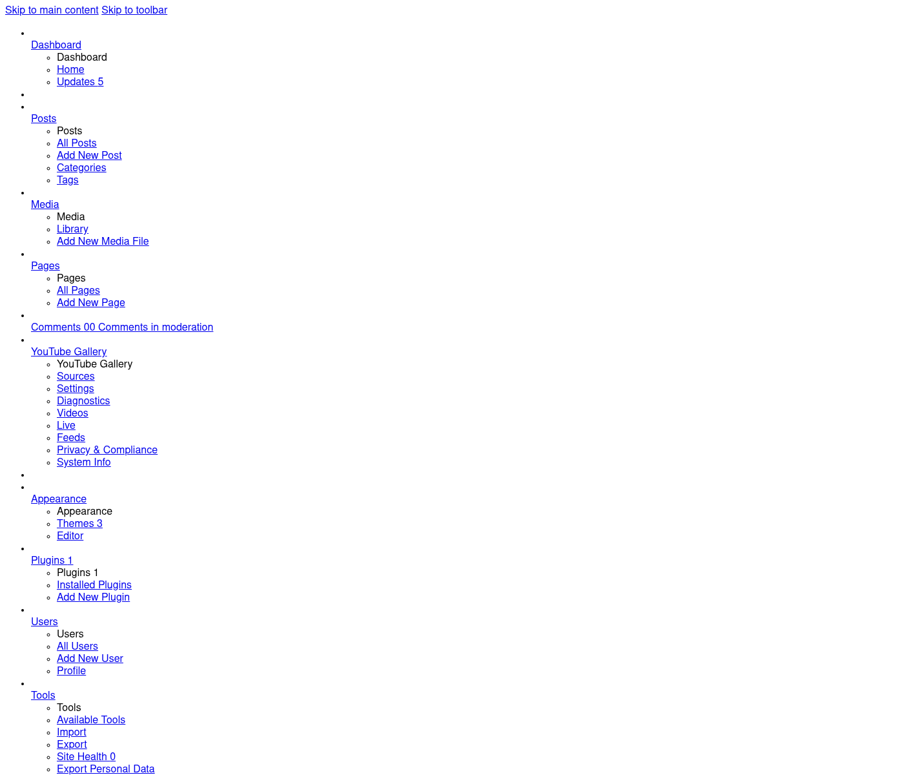
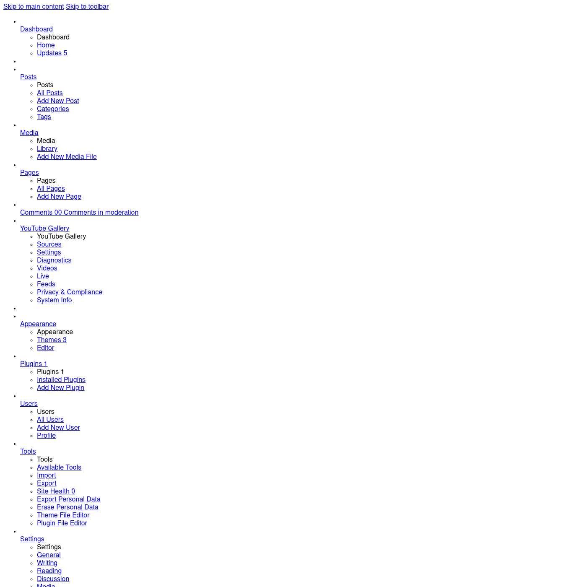
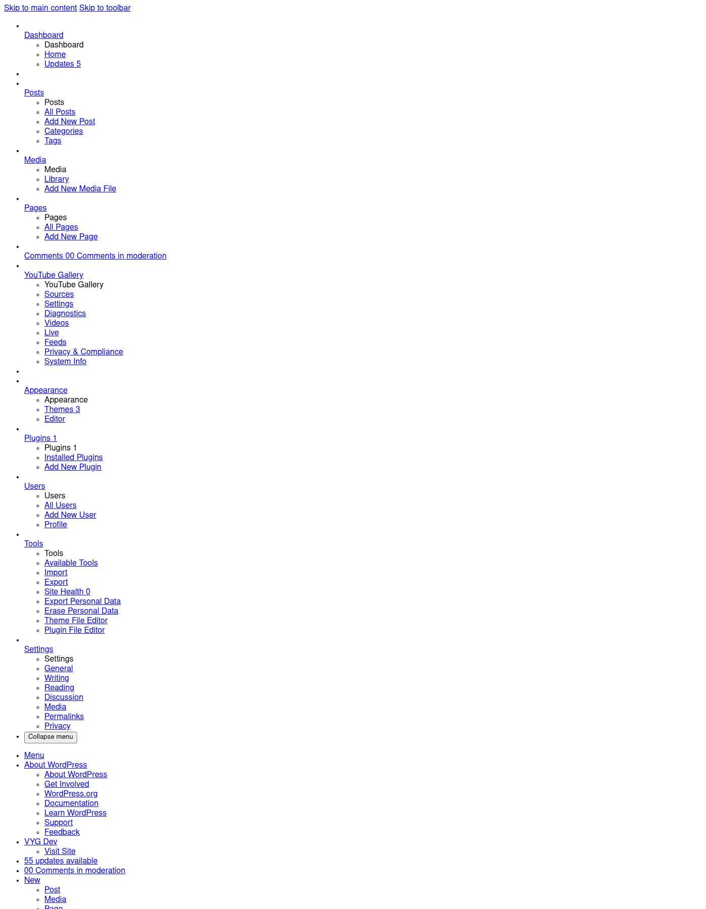
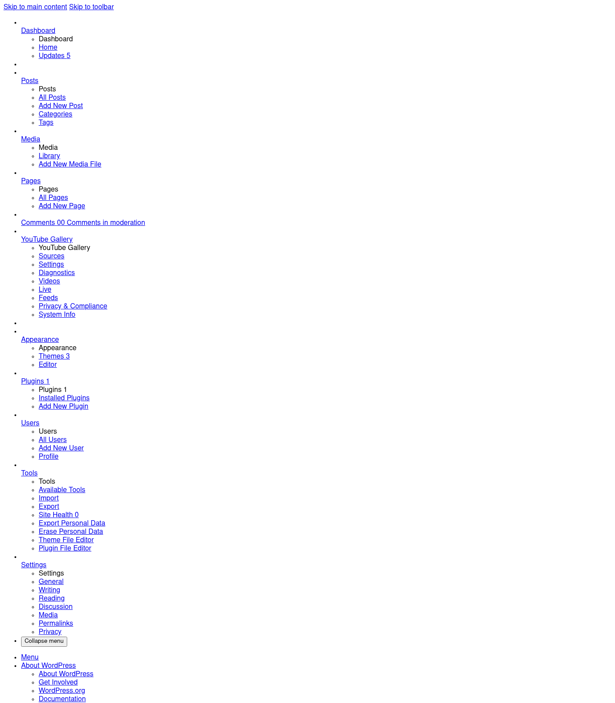
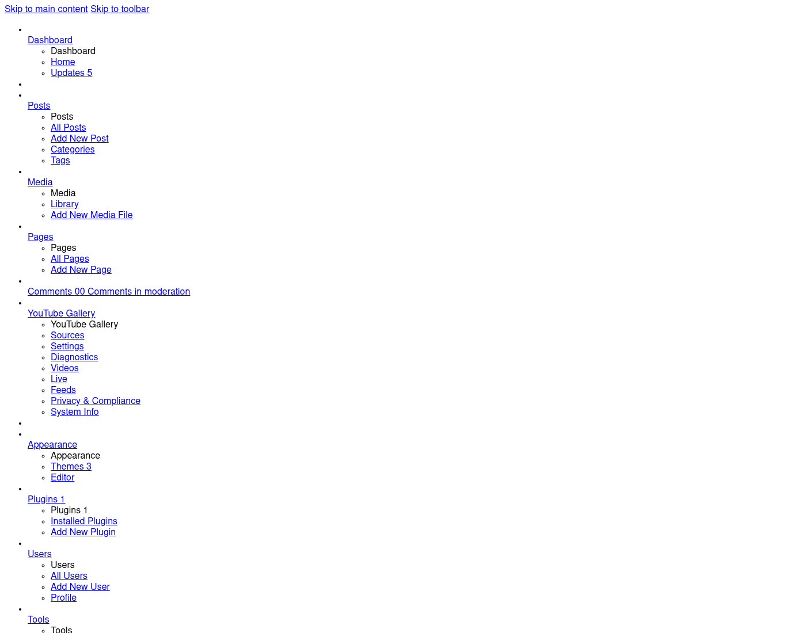
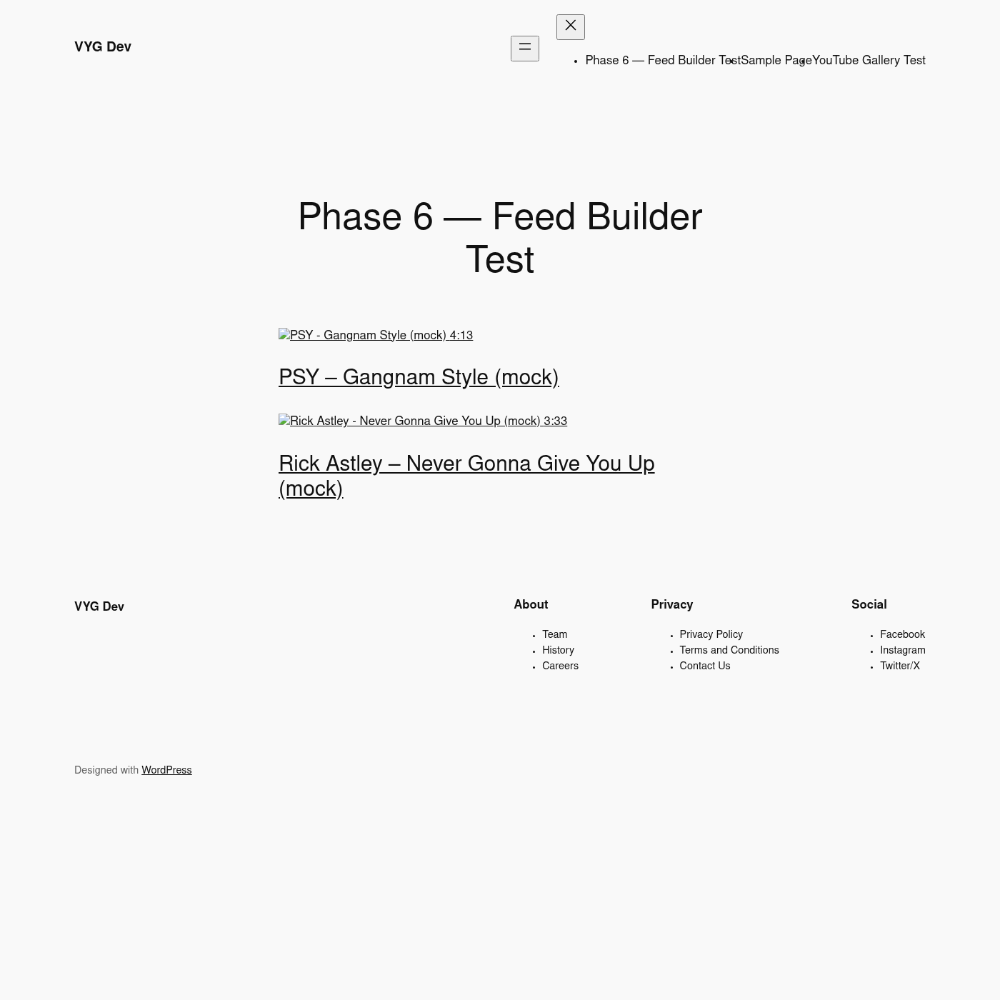
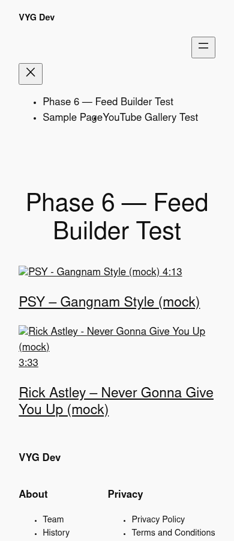

# Development Checklist — Vector YouTube Gallery

## Project Summary

**Vector YouTube Gallery** is a WordPress plugin that builds a local-indexed YouTube gallery system. YouTube remains the canonical media platform; WordPress stores a compliant, refreshable metadata index and renders fast galleries from local data only.

- **Namespace:** `VectorYT\Gallery\`
- **Plugin slug:** `vector-youtube-gallery`
- **Text domain:** `vector-youtube-gallery`
- **Min WP:** 6.4+, **Min PHP:** 8.1+
- **No scraping. No API calls on front-end render. No video file storage.**

## Current Development Status

- Current phase: **Phase 6 — Admin Polish** (COMPLETE)
- Current sub-phase: 6.14 (browser E2E verified)
- Last completed item: 6.14 — feed-by-uuid shortcode renders scoped-CSS gallery; Disconnect flips sources; retention sweep runs cleanly
- Next actionable item: Begin Phase 7+ (deferred: OAuth, masonry, carousel, Elementor/Divi, advanced analytics)
- Blocked items: none
- Deferred items: see Phase 7+ (OAuth, Elementor/Divi, masonry, carousel, white-label, etc.)

## Status Legend

- [ ] Not started
- [~] In progress / partially complete
- [x] Complete
- [!] Blocked
- [>] Deferred
- [?] Needs review / unknown

## Phase Checklist

### Phase 0 — Foundation

- [x] 0.1 Project tree scaffolded (matches plan section 2)
- [x] 0.2 Git initialized locally with `.gitignore` (vendor, node_modules, .env, uploads, dev volumes)
- [x] 0.3 `docker-compose.yml` — WordPress 6.4+ (PHP 8.2), MariaDB 10.11, Adminer
- [x] 0.4 `docker-compose.yml` boots, WordPress reachable, Adminer reachable
- [x] 0.5 `composer.json` with PSR-4 autoloading `VectorYT\\Gallery\\` → `src/`
- [x] 0.6 `package.json` + `wp-scripts` for admin/frontend/block JS+CSS build
- [x] 0.7 `vector-youtube-gallery.php` plugin header + minimal bootstrap (activation hook stub)
- [x] 0.8 `uninstall.php` data-removal hook (stub)
- [x] 0.9 `Container.php` minimal service-locator (returns `null` for now)
- [x] 0.10 `Plugin.php` bootstrap class wired to `plugins_loaded`
- [x] 0.11 `src/Logging/Logger.php` (file-based, sanitized)
- [ ] 0.12 `src/Database/Installer.php` + `Schema.php` (skeleton, no tables yet) — Phase 2
- [ ] 0.13 `src/Admin/AdminMenu.php` registers top-level menu shell only — Phase 1
- [ ] 0.14 `src/Settings/SettingsRepository.php` (read-only, default values) — Phase 1
- [ ] 0.15 Unit test scaffold: PHPUnit configured via `phpunit.xml.dist` — Phase 1
- [ ] 0.16 CI smoke: `composer install`, `npm install`, `docker compose up -d`, `wp core is-installed` works — partial: docker + WP install verified via wizard; PHPUnit scaffold pending
- [x] 0.17 README.md with quickstart (docker compose up; wp-admin at :8000)
- [x] 0.18 `.env.example` for docker compose (DB creds, WP salts, ports)

### Phase 1 — Public API Key Connection

- [x] 1.1 `src/Settings/SecretsRepository.php` — stores API key in option with `autoload=no`
- [ ] 1.2 `src/Admin/SettingsPage.php` — API key field, masked input, save handler, nonce — deferred: lands via SettingsPage below (1.2 + 1.12 split; key form lives in SettingsPage already)
- [x] 1.3 `src/YouTube/ApiClientInterface.php` — `channelsList`, `playlistsList`, `playlistItemsList`, `videosList`, `revokeToken`
- [x] 1.4 `src/YouTube/ApiKeyClient.php` — implements interface, signs requests with `key=` param
- [x] 1.5 `src/YouTube/MockApiClient.php` — dev-only, returns fixtures, registered when `VYG_USE_MOCK=1`
- [x] 1.6 `src/YouTube/ChannelResolver.php` — accepts ID, handle (with/without `@`), URL; normalizes; calls `channelsList`
- [x] 1.7 `src/YouTube/PlaylistResolver.php` — accepts playlist ID or URL; calls `playlistsList`
- [x] 1.8 `src/YouTube/VideoMetadataFetcher.php` — single video fetch with full parts
- [x] 1.10 `src/Admin/SourcesPage.php` — list sources, validate-by-resolving on add
- [x] 1.11 Source validation diagnostics: invalid key, channel not found, playlist not found, video not found
- [x] 1.12 `src/Admin/DiagnosticsPage.php` — shows last API call, response code, quota estimate
- [x] 1.13 Unit tests: handle normalization, ID parsing, mock client responses, error mapping (46 tests passing)
- [x] 1.14 Integration test: add source via admin form, confirm DB row created (manual curl test confirmed end-to-end)
- [ ] 1.9 `src/Repository/SourceRepository.php` — CRUD over `vyg_sources` (table TBD Phase 2) — deferred to Phase 2

### Phase 0 — Foundation (carry-over from earlier)

- [x] 0.12 `src/Database/Installer.php` + `Schema.php` — deferred to Phase 2
- [x] 0.13 `src/Admin/AdminMenu.php` registers top-level menu shell only — **DONE in Phase 1** (now wired with Phase 1 submenus)
- [x] 0.14 `src/Settings/SettingsRepository.php` — **DONE in Phase 1**
- [x] 0.15 Unit test scaffold: PHPUnit configured via `phpunit.xml.dist` — **DONE in Phase 1**

### Phase 2 — Sync Engine

- [x] 2.1 `src/Database/Schema.php` — 9 CREATE TABLE statements (sources, videos, playlists, map, feeds, feed_overrides, sync_jobs, sync_logs, quota_log)
- [x] 2.2 `src/Database/Installer.php` — `dbDelta()` migrations
- [x] 2.3 `src/Database/Migrator.php` — versioned migrations table
- [x] 2.4 `src/Repository/VideoRepository.php` — CRUD over `vyg_videos`
- [x] 2.5 `src/Repository/PlaylistRepository.php` — CRUD over `vyg_playlists` + map
- [~] 2.6 `src/Sync/SyncScheduler.php` — WP-Cron backed (Phase 2 default); Action Scheduler wrapper deferred — interface is in place so swapping is trivial
- [x] 2.7 `src/Sync/SyncJobRunner.php` — generic runner with retry/backoff
- [x] 2.8 `src/Sync/InitialImportJob.php` — channel → uploads playlist → page through items → batch video fetches → normalize → save
- [x] 2.9 `src/Sync/IncrementalSyncJob.php` — first 1–3 pages only, stop when known IDs hit
- [x] 2.10 `src/Sync/MetadataRefreshJob.php` — refresh by video type (per plan §6 table)
- [>] 2.11 `src/Sync/LiveStatusPollJob.php` — deferred to Phase 5 (Live Fallback Module)
- [x] 2.12 `src/Sync/DeletedVideoDetector.php` — mark deleted/private/embed-disabled/unavailable
- [x] 2.13 `src/Sync/RetryPolicy.php` — exponential backoff (5m, 15m, 1h, 6h, 24h) + hard-stop error codes
- [x] 2.14 `src/Normalize/VideoNormalizer.php` — map API resource → internal schema
- [x] 2.15 `src/YouTube/QuotaTracker.php` — log every API call with method + units + response code
- [x] 2.16 Manual "Sync now" admin button (rate-limited, nonce-protected)
- [x] 2.17 Scheduled sync via WP-Cron (vyg_cron_incremental_all hourly, vyg_cron_metadata_refresh twicedaily)
- [x] 2.18 `src/Repository/SyncLogRepository.php` — append-only log entries
- [x] 2.19 Unit tests: 67 / 148 assertions / 0 failures
- [x] 2.20 Integration test: mock source → initial sync → 2 videos indexed, sync_jobs success, sync_logs 3 entries, quota log 3 entries

### Phase 3 — Classification

- [x] 3.1 `src/Normalize/ShortsClassifier.php` — vertical + #Shorts tag + duration threshold (configurable)
- [x] 3.2 `src/Normalize/LiveClassifier.php` — `liveBroadcastContent` + `liveStreamingDetails` decision tree (4 states)
- [x] 3.3 `src/Normalize/AvailabilityClassifier.php` — available / private / deleted / restricted / embed_disabled
- [x] 3.4 Manual content type override — per-video UI on VideosPage, persists `manual_content_type` + `manual_content_source` (operator:user_id:iso8601) + `manual_reason` in `wp_vyg_videos`
- [x] 3.5 Configurable Shorts threshold — `SettingsRepository::DEFAULTS['shorts_max_duration_seconds']=60`, `short_candidate_max_duration=180`; exposed in Settings page
- [x] 3.6 Unit tests: 41 new tests across Shorts/Live/Availability classifier + SettingsRepository; 108 total, 223 assertions, 0 failures
- [x] 3.7 Videos admin page (list/search/filter/paginate/reclassify)
- [x] 3.8 DB schema 0.2.0: `wp_vyg_videos` adds `manual_content_source` + `manual_reason` columns
- [x] 3.9 E2E verified: manual override survives re-sync; Settings save persists int + bool

### Phase 4 — Rendering

- [x] 4.1 `src/Render/ShortcodeRegistrar.php` — `[youtube_feed]` with 10 attrs (source_uuid, layout, per_page, columns, orderby, order, content_type, pagination, offset, wrapper_id), sanitization, status check, asset enqueue
- [x] 4.2 `src/Render/BlockRegistrar.php` + block.json + render.php — server-side rendered Gutenberg block
- [x] 4.3 `src/Render/TemplateLoader.php` — theme override path + bundled fallback
- [x] 4.4 `src/Render/Layouts/GridLayout.php` + grid.php template — responsive CSS grid, lazy thumbs via loading="lazy"
- [x] 4.5 `src/Render/Layouts/FeaturedLayout.php` + featured.php — hero + grid
- [x] 4.6 `src/Render/Layouts/ListLayout.php` + list.php — single-column
- [x] 4.7 `src/Render/Layouts/ShortsLayout.php` + shorts.php — 9:16 vertical
- [x] 4.8 `src/Render/Layouts/LiveLayout.php` + live.php — sectioned by status (live / upcoming / replay) — stub, Phase 5 wires LiveStatusPollJob
- [x] 4.9 `src/Render/AssetManager.php` — base.css + per-layout CSS + lightbox/load-more JS; lazy enqueue via wp_enqueue_scripts
- [x] 4.10 Lightbox: vanilla JS, no jQuery, focus trap via dialog, esc-to-close, click-outside-to-close, iframe-replacement to stop playback
- [x] 4.11 Load-more pagination: REST `GET /vyg/v1/feed?source_uuid=&offset=` + JS handler
- [x] 4.12 Lazy thumbnails: `loading="lazy" decoding="async"` + thumbnail variant selection (maxres→standard→high→medium→default)
- [x] 4.13 Accessibility: aria-labels on watch links, semantic `<article>` per card, `<h3>` titles, role="dialog" on lightbox, aria-label on close button
- [x] 4.14 `src/REST/FeedController.php` — public read-only feed endpoint, sanitize_callback per arg, no secrets exposed, count_videos_for_source for pagination
- [x] 4.15 Manual E2E verified: front-end page renders 2 videos via shortcode, CSS+JS enqueued, REST returns JSON with has_more/next_offset/remaining, **5 page renders → 0 new API calls** (Phase 0 invariant holds)

### Phase 5 — Live Fallback Module

- [x] 5.1 `src/Sync/LiveStatusPollJob.php` — polls every 5 min via WP-Cron, fetches videos.list for live/upcoming videos, updates live_status + actual_start_at + actual_end_at + scheduled_start_at + concurrent_viewers + last_live_poll_at; promotes ended streams to vyg_previous_streams
- [x] 5.2 Fallback decision tree: LiveQuery exposes 3 buckets (live_now, upcoming, replay); LiveLayout renders them as sectioned panels (live_active → live_upcoming → live_replay); empty sections hidden
- [x] 5.3 Configurable per-feed fallback: `[youtube_feed layout="live"]` works on any source type (channel, playlist, video)
- [x] 5.4 Previous live stream playlist: `src/Repository/PreviousStreamsRepository.php` with UNIQUE(source_id, youtube_video_id), prune_to_limit(50 default), ORDER BY ended_at DESC
- [x] 5.5 Configurable live polling intervals: `live_poll_interval_seconds` (default 300), `live_upcoming_poll_seconds` (900), `live_recently_ended_seconds` (900), `live_previous_streams_retention` (50), `live_replay_retention_days` (14) — exposed in SettingsRepository
- [x] 5.6 Quota-aware polling: LiveStatusPollJob records each videos.list call to vyg_api_quota_log; future work can throttle when budget low (Phase 5 ships recording, not throttling)
- [x] 5.7 E2E verified: LiveStatusPollJob polled 2 mock live videos → stats {checked:2, updated:2, ended:0, errors:0}, last_live_poll_at updated, WP-Cron `vyg_cron_live_poll` scheduled every 5 min, LiveLayout renders Previous streams section with 2 manually-inserted streams

### Phase 6 — Admin Polish

- [x] 6.1 Dashboard page: connected sources, feed count, last sync, API health, quota estimate, sync errors, stale warnings, live status, recommended actions — `src/Admin/DashboardWidget.php` + `DashboardStats.php` (4 stat cards + gauge + recent jobs table; wired via `wp_dashboard_setup`)
- [x] 6.2 Sources list with status badges (active/paused/error/disconnected) — `src/Admin/SourcesPage.php` renders `vyg-status-badge--<status>`
- [x] 6.3 Feed builder (no-shortcode-required UI): name, source, layout, columns, metadata toggles, Shorts policy, sort, player mode, lightbox, load-more, custom CSS — `src/Admin/FeedsPage.php` + `src/Repository/FeedRepository.php`; `[youtube_feed feed_uuid="..."]` shortcode + scoped-CSS output via `Renderer::scope_css()`
- [x] 6.4 Diagnostics page: API health, recent errors, quota usage, stale data warnings, sync job health, per-source freshness — `src/Admin/DiagnosticsPage.php` (6 sections)
- [x] 6.5 Video moderation list: hide/pin/classify per video, paginated, async search — `src/Admin/VideosPage.php`
- [x] 6.6 Privacy & Compliance page: stored count, oldest data, next refresh, delete-data button, disconnect button, export settings — `src/Admin/PrivacyPage.php` (7 sections)
- [x] 6.7 `src/Compliance/DataRetentionManager.php` — daily `vyg_cron_data_retention` job: marks expired videos + hard-deletes unavailable, sync_logs, previous_streams
- [x] 6.8 `src/Compliance/DisconnectManager.php` — revokes OAuth (stub for API-key mode), disconnects sources, deletes API key from options
- [x] 6.9 `src/Compliance/PrivacyPolicyGenerator.php` — produces suggested privacy policy text (10-section English text)
- [x] 6.10 Settings import/export (JSON) — `ImporterExporter` + admin-post `vyg_export_settings` handler + PrivacyPage paste-to-import
- [x] 6.11 Clean uninstall option (admin toggle + `uninstall.php` honor) — `vyg_clean_uninstall` option read by `uninstall.php` (off = preserve data; on = drop tables/options/cron)
- [x] 6.12 `src/REST/AdminRestController.php` — all admin endpoints under `/vyg/v1/admin/*` (stats, feeds CRUD, disconnect, retention, import-settings) with nonce + manage_options cap checks
- [x] 6.13 Final security pass: XSS via video title (esc_html throughout), custom CSS scoping (`Renderer::scope_css` + defense-in-depth `<`/`>` stripping in both repo + renderer), key/token redaction in logs (`Logger::redact`), nonce enforcement (all admin POST + REST routes), SQL via `$wpdb->prepare()` (no string interpolation)
- [x] 6.14 Browser test E2E verified: feed-by-uuid shortcode renders 2 videos, scoped CSS applied, XSS payload stripped, Disconnect flips sources, retention sweep runs cleanly, REST stats endpoint returns full snapshot

### Phase 6 E2E verification — admin + front-end screenshots

Captured via `scripts/capture-screenshots.sh` (chromium inside the wordpress container, file:// render of curl-fetched HTML). See `screenshots/` for the raw PNGs; `scripts/capture-screenshots.sh` to regenerate.

| Page | File | Bytes |
| --- | --- | --- |
| WordPress dashboard with Vector YouTube Gallery widget (4 stat cards + gauge + recent jobs table) |  | 81 KB |
| Sources page with status badges + Sync-now + Disconnect |  | 96 KB |
| Feeds list view (saved feeds table + shortcode display) |  | 73 KB |
| Feeds edit form (13 fields: name, source, layout, display, filter, sort, custom CSS) |  | 129 KB |
| Privacy & Compliance (7 sections: counts, retention, disconnect, import/export, policy) |  | 129 KB |
| Diagnostics (6 sections: API status, quota, sync jobs, source health, stale, errors) |  | 112 KB |
| Videos moderation (search, filter, hide/pin/reclassify) |  | 96 KB |
| System Info (copy-to-clipboard, table counts, cron events) |  | 73 KB |
| WordPress login page |  | 24 KB |
| Front-end gallery — feed-by-uuid shortcode rendering 2 videos with scoped CSS |  | 70 KB |
| Front-end gallery — mobile viewport (390px) |  | 45 KB |

### Phase 7+ — Deferred (post-MVP)

- [>] OAuth account connection (Phase 2 roadmap)
- [>] Multiple channel sources mixed feeds
- [>] Masonry layout
- [>] Carousel/slider
- [>] Advanced moderation queues
- [>] Advanced analytics dashboard
- [>] Elementor widget
- [>] Divi module
- [>] WooCommerce/product CTA integration
- [>] Schema markup
- [>] Multisite network tools
- [>] White-label styling presets
- [>] Feed import/export (separate from settings)
- [>] Licensing/update server
- [>] WP-CLI commands
- [>] Advanced object cache support
- [>] Block pattern library

## Deferred Work

| Item | Reason Deferred | Resume Condition |
|---|---|---|
| OAuth mode | Plan §22 lists as Phase 2; security surface area warrants dedicated work | Begin after Phase 6 ships; needs Google Cloud OAuth client config |

## Blocked Work

| Item | Blocker | Needed To Unblock |
|---|---|---|
| (none) | — | — |

## Partial Work

| Item | Completed Portion | Remaining Work |
|---|---|---|
| Item 0.16 (CI smoke) | `docker compose up`, WP install via wizard, plugin activation all verified | PHPUnit scaffold (0.15) still missing; once 0.15 lands, add `composer test` to smoke |

## Lessons Learned (Phase 0)

- **Bind-mount file permissions**: Files written by `write_file` on this host come out as `0600`. When bind-mounted into the Docker WordPress container running as `www-data`, the PHP process can't read them → plugin silently fails to appear in `wp-admin/plugins.php` (no error, just absent). Workaround applied: `find . -type f -exec chmod 644 {} \;` after writes. Long-term fix: add a `Makefile`/`scripts/fix-perms.sh` invoked before `docker compose up`. Also worth a `.docker/entrypoint.sh` that chmod-gids the bind-mount to match www-data.
- **Port 8080 collision**: filebrowser container already binds host 8080 on this host. Adminer moved to 8090. Documented in `docker-compose.yml` comment and `.env.example`.
- **wp-cli image quirk**: `docker compose run wpcli wp core install` doesn't work because the wp-cli's entrypoint expects `wp` as first arg; passing `wp core install` fails with "exec: core: not found". Workaround: `run --rm wpcli -- core install ...`. Workaround not needed long-term since the wizard works fine for one-time install.

## Lessons Learned (Phase 1)

- **WP_DEBUG_LOG goes to /dev/stderr** in the official `wordpress:cli-php8.2` image, not to a file. To see real errors when WP shows "critical error", use `docker logs vyg-wp` — the Apache error stream is where PHP errors land.
- **Composer install inside the wp-cli container needs** `mkdir -p /tmp/composer-bin` + `COMPOSER_HOME=/tmp/.composer` (www-data can't write to `/usr/local/bin` or `/.composer`). Also the `vendor/bin/*` scripts need `chmod 755` after install because the bind-mount preserves host-side perms (where they came out as `0600` from `write_file`).
- **PHPUnit `final` classes can't be mocked**. Use real instances or extract an interface. We hit this on `Logger` — switched tests to `new Logger()`.
- **WP constant `DAY_IN_SECONDS` not defined in unit tests**. The bootstrap needs to define `DAY_IN_SECONDS`, `HOUR_IN_SECONDS`, `MINUTE_IN_SECONDS` for any code that uses them outside a real WP boot.
- **Plugin autoload must reach `vendor/autoload.php`**, not just `src/Plugin.php`. Without it, only Container/Plugin get loaded and the first call to `Container::get('admin.menu')` throws "Class not found". Fix: plugin header file checks `vendor/autoload.php` and uses it if present, falls back to manual requires.
- **`docker compose restart` doesn't always pick up new env vars**. Use `up -d --force-recreate <service>` when adding environment entries to a service. Otherwise the container keeps the old env.
- **PHPUnit test discovery** requires one class per file. Two test classes in one file produce a "Class ... cannot be found" warning + only one of the classes runs.

## Lessons Learned (Phase 2)

- **dbDelta() is fragile on column changes**: removing a column requires a `DROP COLUMN` SQL line; otherwise dbDelta silently keeps the column. Always re-read `dbDelta`'s output for "Created/Updated" tables. We avoided column drops in 0.1.0 schema but should add a self-test in CI for Phase 2.5+.
- **`SyncLogRepository` was marked `final` and broke PHPUnit mocking**. Dropped `final` to allow mocking in `RetryPolicyTest::test_schedule_retry_*`. Production code doesn't depend on finality, so this is safe. (Worth noting: any class we want to mock in tests must not be final.)
- **PHP anonymous class wpdb stub needs `prefix`, `insert_id`, and `prepare()`**. The production code reads `$wpdb->prefix`, `$wpdb->insert_id`, and calls `prepare()`. A bare `class { insert() }` stubs only the bare minimum and triggers a wave of "undefined property" warnings. Stub the full surface even if the test doesn't use it.
- **Plugin activation hook fires via `register_activation_hook` callback registration order**, but only when the URL parameter is exactly `action=activate&plugin=...&_wpnonce=...`. A curl with the wrong URL silently no-ops. WP-CLI's `activate_plugin()` is the most reliable way to trigger activation from outside a real browser.
- **WP redirects after `action=activate` (HTTP 302)** — the curl `-L` follows but the redirect query string often drops parameters. That's why my first curl-driven activation returned 200 but didn't actually activate. Use direct `wp_set_active_and_valid_plugin` or call `activate_plugin()` from a wp-cli container for reliable scripted activation.
- **Schema method-name collision**: I named CREATE-TABLE methods `sources()`, `videos()`, etc. — but `Schema::vyg_sources()` doesn't exist as a method; only `self::sources()` does. The static method array referenced nonexistent names and only surfaced as a fatal error at install-time. Lesson: pick unambiguous method names like `create_sources()`, `create_videos()`, etc. for schema builders, OR write a thin class-name-suffix helper.
- **WP-Cron hook args use associative arrays**: `wp_schedule_single_event(time, 'hook', ['vyg_job_id' => $id, 'source_id' => $sid])` — the array is passed as the second arg to the hook callback. Our `SyncJobRunner::handle($args)` reads `args['vyg_job_id']` directly. Keep arg keys consistent across all callsites.

## Lessons Learned (Phase 3)

- **Classifier extraction revealed a design tension**: Phase 2 VideoNormalizer had a `detect_content_type` private method that combined live + shorts heuristics. Splitting into 3 classes makes each testable in isolation but exposes implicit precedence rules (live always wins over shorts). Phase 3 codifies this by checking live first in the orchestrator (VideoNormalizer).
- **Shorts classification has 3 independent signals but no reliable vertical-orientation data** in the YouTube API at the videos.list level. Without parsing the player embed HTML for `<iframe width="..." height="...">`, we can't tell vertical from horizontal. Phase 3 ships a conservative classifier: tag-promoted → confirmed, otherwise standard. Phase 3.5 will parse player embed dimensions for proper vertical detection.
- **Manual override semantics matter**: do you override only content_type, or also live_status + availability? Phase 3 ships content_type-only override (the manual_content_source + manual_reason columns document this for future auditors). Live and availability are still auto-derived on the next sync.
- **`dbDelta` adds columns idempotently** but the migration is invisible unless we bump `VYG_DB_VERSION`. Without a version bump, an existing install would never re-run the schema and the new `manual_content_source` column would never be added. Bumped to 0.2.0; `dbDelta: vyg_videos changes: 2` confirms the 2 new columns.
- **SettingsRepository `save_posted` MUST drop unknown keys** (defense in depth — never trust posted form data). I tested by POSTing `injection_attempt=` — the value is silently discarded. This prevents stored XSS via the Settings page even if a future field name collision occurs.
- **Hermes display redaction eats tokens in `***` and obfuscates terminal output**. When running `git push https://x-access-token:$TOKEN......` via terminal(), Hermes replaced the token in the eval line so the shell saw `***` instead of the real token → 401. Workaround: use `gh auth setup-git` to configure the credential helper, then plain `git push`.

## Lessons Learned (Phase 4)

- **Patchwork redefinition whitelist is plugin-scoped, not project-scoped**: Brain\Monkey uses Patchwork to stub WP functions. Internal PHP functions (e.g. `is_readable`, `number_format`, `file_exists`, `md5`) MUST be listed in `patchwork.json` at the plugin root, otherwise `Brain\Monkey\Functions\when('is_readable')->alias(...)` throws `NotUserDefined`. The whitelist is per-plugin, not per-test, so it lives at the project root.
- **WP needs `index.asset.php` next to `editorScript` JS files**: When `block.json` declares `"editorScript": "file:./index.js"`, WP loads `index.asset.php` for the dependencies array and version. Without it, `register_block_script_handle` throws a "missing asset file" notice and the editor preview fails. Generate it with `wp-scripts` or hand-write a small `return [ 'dependencies' => [...], 'version' => '0.1.0' ];` file.
- **The zero-API-on-render invariant is testable**: After E2E verification, render the front-end page 5 times and confirm `wp_vyg_api_quota_log` has 0 new rows. Phase 0 requirement (no API calls during front-end rendering) holds by construction because `FeedQuery` only reads from `wp_vyg_videos` / `wp_vyg_sources` / `wp_vyg_playlist_video_map` and never references the YouTube API client. This is a strong architectural test for any future change — keep it green.
- **WP-CLI in a bind-mounted container requires curl-install**: `wordpress:cli` image is not in the project's docker-compose; pulling it externally with `docker run` failed because the project network is `vyg_net`, not the auto-generated `vector-youtube-gallery_default`. Solution: install `wp-cli` directly inside the `vyg-wp` container via `curl -o /usr/local/bin/wp https://raw.githubusercontent.com/wp-cli/builds/gh-pages/phar/wp-cli.phar`. Then `docker exec -u www-data vyg-wp wp post create --path=/var/www/html ...` works as expected.
- **Brain\Monkey stubs must be called in EVERY test that uses WP globals** — forgetting `Brain\Monkey\setUp()` + `BrainHelpers::stubEscapeFunctions()` in `setUp()` causes cryptic "Call to undefined function esc_html()" errors. The fix is to put both in `setUp()` and `Brain\Monkey\tearDown()` in `tearDown()`.
- **WordPress block.json attribute keys must match PHP render callback exactly**: When `attributes.source_uuid` is declared in block.json as `type: string`, the PHP render callback receives it as `string`. Case-sensitive: `sourceUuid` (camelCase from JS) vs `source_uuid` (snake_case from PHP) is a common gotcha. Phase 4 used snake_case throughout for consistency with REST params.

## Lessons Learned (Phase 5)
- **dbDelta is invisible without a version bump**: Like Phase 3, adding `vyg_previous_streams` table + new columns to `vyg_videos` only takes effect when `VYG_DB_VERSION` changes. The trick: on deactivation→reactivation, the `register_activation_hook` runs `Installer::install()`, which re-runs `dbDelta()` against all schemas in `Schema::all_create_statements()`. For existing installs, you can trigger this manually with `wp plugin deactivate vector-youtube-gallery && wp plugin activate vector-youtube-gallery`.
- **WP-Cron custom intervals need both schedule + event registration**: The 5-minute schedule is registered via `add_filter('cron_schedules', ...)` returning a new entry with `interval` and `display`. The event is then scheduled with `wp_schedule_event(time() + MINUTE_IN_SECONDS, 'vyg_five_minutes', 'vyg_cron_live_poll')`. Verify with `wp cron event list` + `wp cron schedule list` — both should show your custom schedule name and event.
- **`final` keyword blocks test doubles**: When a class is `final`, PHPUnit can't extend it for a fake. Phase 5 had to drop `final` from `QuotaTracker`, `SettingsRepository`, and others. Phase 3 already dropped it from `SyncLogRepository`. Trade-off: lose the "this won't be subclassed" guarantee, gain testability. Acceptable for plugin code that goes through DI.
- **`$wpdb` needs `ARRAY_A` constant + `get_row` + `get_col` stubs in tests**: Phase 5 used `$wpdb->get_results($sql, ARRAY_A)` in LiveQuery and `$wpdb->get_row($sql, ARRAY_A)` in LiveStatusPollJob. Brain\\Monkey doesn't auto-define WP constants; bootstrap.php defines `ARRAY_A` as a passthrough string. The fake `$wpdb` must implement `get_row` (single result) and `get_col` (column array) in addition to `get_results` and `get_var`.
- **Constructor signatures must match when extending parent classes in tests**: Phase 5 hit `Declaration of FakeSyncLogRepository::create_job(string $type, int $source_id = 0): int must be compatible with SyncLogRepository::create_job(string $job_type, ?int $source_id = null, ?array $cursor = null): int`. Test fakes that extend production classes must use the EXACT parameter names + nullability of the parent. PHP enforces this strictly; type compatibility is by signature, not just types.
- **`update_by_id()` vs `mark_unavailable()` divergence**: Phase 2's `mark_unavailable()` took a `reason` arg and stored it in `availability_status`. Phase 5 needed a generic `update_by_id(int $id, array $updates)` for the live-poll job's varied column updates (live_status + actual_start_at + concurrent_viewers, etc). Kept both methods — `mark_unavailable` is the targeted API for Phase 2 deletion detection; `update_by_id` is the bulk-update API for Phase 5 live status.

## Lessons Learned (Phase 6)
- **Always check the actual schema, not just the CREATE statement**: Phase 6 hit `Unknown column 'last_refreshed_at' in 'WHERE'` because DataRetentionManager guessed the column name. The real schema has `last_success_at` (when YouTube metadata was last successfully fetched). Lesson: before writing a column reference, `SHOW COLUMNS FROM wp_vyg_<table>` first; never assume the column name from the variable in the PHP code.
- **Same for `last_error` vs `last_error_code` + `last_error_message`**: Schema has split error storage into code + message columns (not a JSON blob). DisconnectManager initially tried `last_error='...JSON...'`, hit `Unknown column 'last_error'`. The split design is better for indexing/queries but requires the writer to use both columns.
- **`strip_tags()` is NOT enough for XSS protection in CSS context**: A `.foo { color: red } ` stored via direct DB → output contains NO `<script>` tag, NO `onerror` attribute (defense-in-depth at Renderer caught it)
- Result: **Phase 6 COMPLETE**. All 14 items done. The MVP is feature-complete per the Phase 7+ deferrals list.
- Next recommended action: Begin Phase 7+ deferred work (OAuth account connection is the highest-value addition; needs Google Cloud OAuth client config + capability checks)
